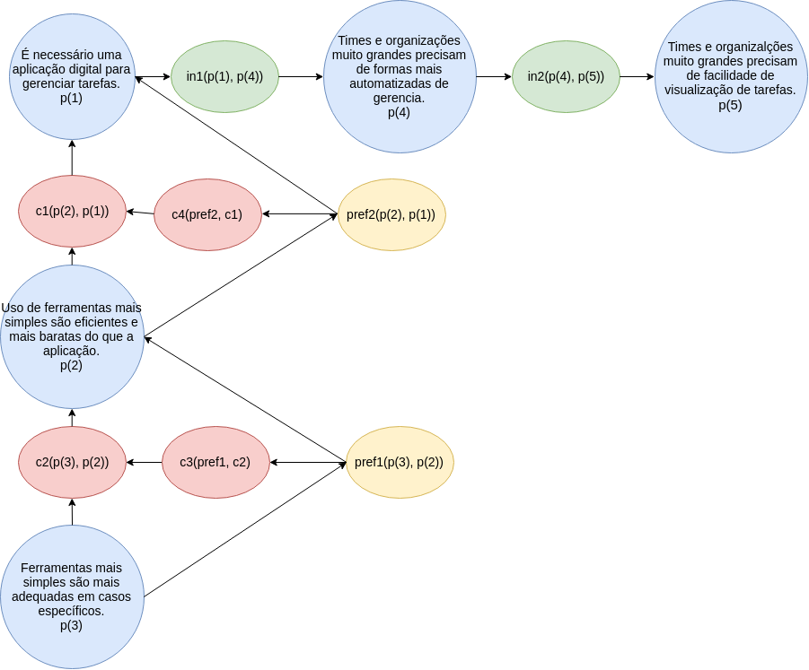
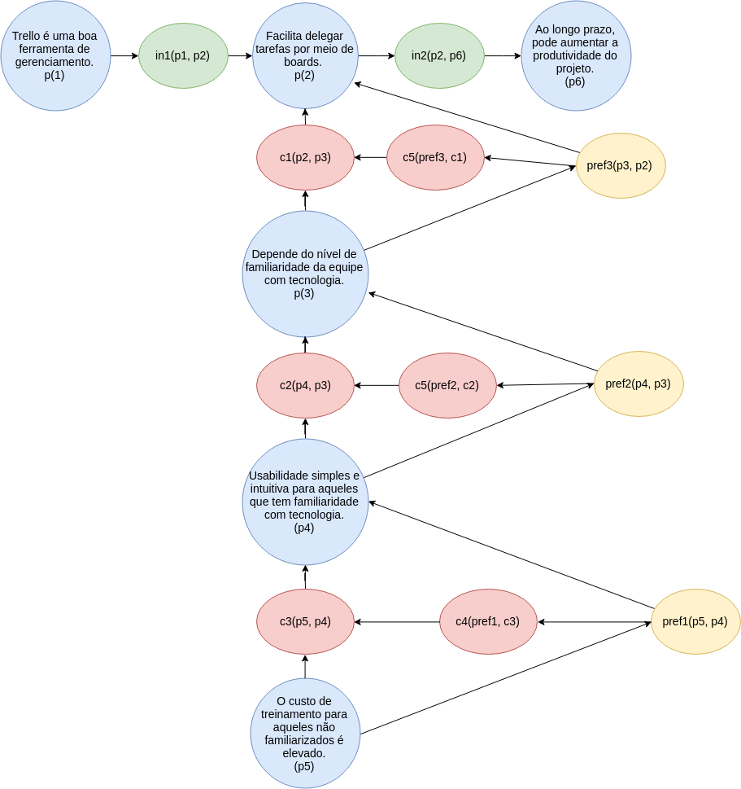

# Argumentações

Os Diagramas de Argumentação são representações gráficas em formato de grafo que auxiliam a rastreabilidade de tomada de decisões que ocorreram através de processos argumentativos.

Os nós podem representar _Proposições_ (p), _Inferências_ (in), _Contradições_ (c) ou _Preferências_ (pref).

Cada digrama deve conter uma decisão argumentada pelo time.

### Aplicação Digital

A presente argumentação trata da discussão sobre a necessidade de uma aplicação digital para a resolução dos problemas levantados através dos [Rich Pictures](/rich%20pictures.html).

Atraveś do diagrama é possível observar que, apesar de kanbans físicos serem mais simples no manuseio (p2), um kanban físico não teria ferramentas adequadas à todos os projetos (p3).

Com isso, chegou-se à conclusão de que em projetos grandes ou equipes grandes (p4 e p5), formas de automatização das gerencias e facilidade na visualização das tarefas, ambas contempladas na aplicação digital, trazem facilidades imprescindíveis num bom gerenciamento de tarefas.

### Viabilidade Econômica

A discussão de viabilidade levantou duas ideias
- Exibir publicidade na plataforma ou
- Cobrar por planos que contenham recursos extras

Como pode-se observar no diagrama, o time decidiu que publicidade é uma má ideia porque poluiria a aplicação que tem como premissa a ideia de algo simples (p3). Este argumento prevaleceu sobre o de utilizar publicidade (p2), como se pode observar no nó de preferência (pref1).

Com isso, foi decidido pela ideias de planos cobrados à parte (p4). Essa proposta se mostrou interessante também porque, como a gama de problemas a serem resolvidos varia conforme pode ser visto nos [Rich Pictures](/rich%20pictures.html), as necessidades dos usuários podem variar bastante, o que faz com que nem todos precisem de recursos custosos (p5).

### Gerenciamento de atividades

Nesta discussão foi debatido o Trello como uma boa ferramenta de gerenciamento. Tópico este também tratado nos [Rich Pictures](/rich%20pictures.html).

No diagrama é possível perceber que existe bastante controvérsia em relação a este tópico. Porém, em sítese, pode-se perceber que o nível de familiaridade com tecnologia (p3) e a dificuldade de treino de equipe não familiarizada (p5), são dois dos pontos fracos observados pela equipe.

Porém, a usabilidade simples e intuitiva (p4) e a facilidade na delegação de tarefas (p2) se mostraram mais importantes na decisão de uso da tecnologia. Além disso, a possibilidade de aumento de produtividade a longo prazo (p6) é vista como um adicional de grande valia no processo de gerenciamento, tornando, assim, o Trello uma boa ferramenta de gerenciamento.