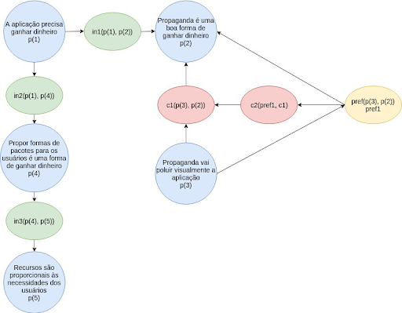

# Argumentações

Os Diagramas de Argumentação são representações gráficas em formato de grafo que auxiliam a rastreabilidade de tomada de decisões que ocorreram através de processos argumentativos.

Os nós podem representar _Proposições_ (p), _Inferências_ (in), _Contradições_ (c) ou _Preferências_ (pref).

Cada digrama deve conter uma decisão argumentada pelo time.

### Viabilidade Econômica

A discussão de viabilidade levantou duas ideias
- Exibir publicidade na plataforma ou
- Cobrar por planos que contenham recursos extras

Como pode-se observar no diagrama, o time decidiu que publicidade é uma má ideia porque poluiria a aplicação que tem como premissa a ideia de algo simples (p3). Este argumento prevaleceu sobre o de utilizar publicidade (p2), como se pode observar no nó de preferência (pref1).

Com isso, foi decidido pela ideias de planos cobrados à parte (p4). Essa proposta se mostrou interessante também porque, como a gama de problemas a serem resolvidos varia conforme pode ser visto nos [Rich Pictures](/rich%20pictures.html), as necessidades dos usuários podem variar bastante, o que faz com que nem todos precisem de recursos custosos (p5).