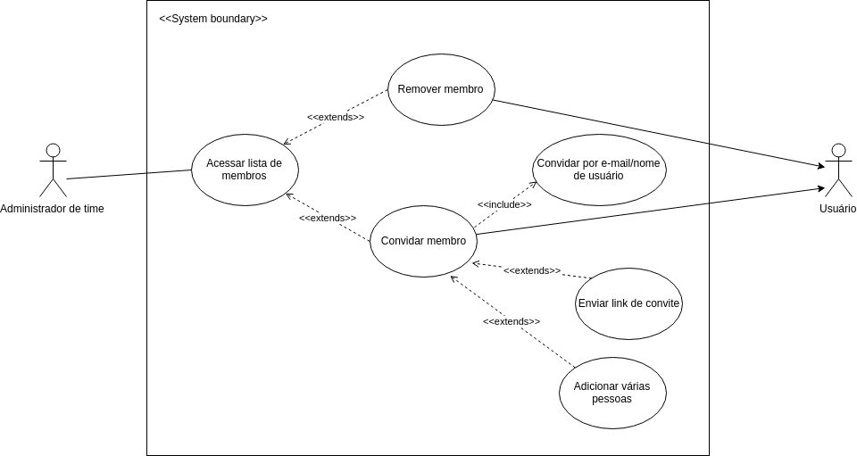

# Casos de uso
Diagramas de casos de uso, ou diagramas comportamentais na documentação UML, são responsáveis por descrever as principais funcionalidades do sistema e a interação dessas funcionalidades com os usuários do próprio sistema.
Para tal, o diagrama dispõe de atores que representam usuários ou sistemas que interagem com o sistema em questão, elipses que representam ações e relações entre as elipses, que podem ser do tipo include ou extend.

## Diagramas:

### Caso 5: Criar time

### UC01 - Criar time

|  |  |
|  ------: | :------ |
|  **Descrição** | Tem como objetivo a criação de um time para melhorar a organização de quadros e arquivos que devem pertencer a um grupo específico de usuários. |
| **Atores** | Usuário |
| **Pré Condições** | O usuário deve estar logado  no sistema. |
| **Fluxo Principal** | **FP01 - Criar time** 1. Usuário acessa a opção de criar time. 2. Usuário digita o nome do time. [UC02][FA01][FA02] 3. Time criado com sucesso. Usuário é redirecionado para página do time. |
| **Fluxos Alternativos** | **FA01 - Adicionar descrição** 1. Usuário adiciona descrição do time [UC03]. **FA02 - Acessar informações de business class** 1. Usuário acessa informações do business class [UC04] |
| **Fluxos de Exceção** | Não se aplica. |
| **Pós Condições** | Time é criado com informações dadas pelo usuário. |

### UC02 - Adicionar nome

|  |  |
|  ------: | :------ |
|  **Descrição** | Permite nomear times criados pelo usuário. |
| **Atores** | Usuário |
| **Pré Condições** | O usuário deve estar logado  no sistema.  Formulário de criação de time deve estar selecionado.|
| **Fluxo Principal** | **FP01 - Adicionar nome** 1. Usuário digita o nome do time. 2. Usuário clica em no botão "criar".  3. Time criado com sucesso. Usuário é redirecionado para página do time. |
| **Fluxos Alternativos** | Não se aplica. |
| **Fluxos de Exceção** | Não se aplica. |
| **Pós Condições** | Time é criado com informações dadas pelo usuário. |

### UC03 - Adicionar descrição

|  |  |
|  ------: | :------ |
|  **Descrição** | Permite adicionar descrição a times criados pelo usuário. |
| **Atores** | Usuário |
| **Pré Condições** | O usuário deve estar logado  no sistema.  Formulário de criação de time deve estar selecionado.|
| **Fluxo Principal** | **FP01 - Adicionar descrição** 1. Usuário digita o nome do time. 2. Usuário digita descrição do time. 3. Usuário clica em no botão "criar".  4. Time criado com sucesso. Usuário é redirecionado para página do time. |
| **Fluxos Alternativos** | Não se aplica. |
| **Fluxos de Exceção** | Não se aplica. |
| **Pós Condições** | Time é criado com informações dadas pelo usuário. |

### UC04 - Acessar informações de business class

|  |  |
|  ------: | :------ |
|  **Descrição** | Permite ter acesso a informações relevantes sobre as vantagens da assinatura do plano de business class. |
| **Atores** | Usuário |
| **Pré Condições** | O usuário deve estar logado  no sistema.  Formulário de criação de time deve estar selecionado.|
| **Fluxo Principal** | **FP01 - Acessar informações de business class** 1. Usuário clica "saiba mais" no texto referente ao business class.. 2. Nova guia do navegador é aberta contendo informações referentes ao business class.  |
| **Fluxos Alternativos** | Não se aplica. |
| **Fluxos de Exceção** | Não se aplica. |
| **Pós Condições** | Time é criado com informações dadas pelo usuário. |

### Caso 6: Adicionar/remover membros de time

### Caso 7: Alterar configurações de time

### Caso 8:  Alterar configurações de board

### Caso 10: Board

### UC01 - Criar Board
### Descrição
- Criar um board para planejamento de projeto ou uso da maneira que melhor se enquadra ao contexto do usuário.

### Atores
- Usuário.

### Pré Condições
- O usuário deve estar logado na aplicação e possuir acesso a internet.

### Pós Condições
- O usuário terá um board para seu projeto, pessoal ou em grupo, para se organizar.
### Fluxo Principal
- O usuário loga na aplicação
- O usuário clical em criar Board

### Fluxos de Exceção
- O usuário ser convidado para um Board.
- O usuário criar um time.

### UC02 - Ver um Board
### Descrição
- Ter uma visão macro do board.

### Atores
- Usuário.

### Pré Condições
- O usuário deve estar logado na aplicação e possuir acesso a internet, possuir ou estar vinculado a um board para visualizá-lo.

### Pós Condições
- O usuário poderá ver o board de forma macro, como cards e colunas vinculadas.

### Fluxo Principal
- O usuário loga na aplicação
- O usuário clical em um board que deseja visualizar
- O usuário visualiza o board

### Fluxos de Exceção
- O usuário ter imprimido o board anteriormente, poderá visualizá-lo sem a necessidade de entrar na aplicação.

### UC03 - Seguir um Board
### Descrição
- Ter um vinculo a um board para poder acompanhar toda e qualquer alteração realizada no board.

### Atores
- Usuário

### Pré Condições
- O usuário deve estar logado na aplicação e possuir acesso a internet, possuir ou estar vinculado a um board.

### Pós Condições
- O usuário poderá receber notificações sempre que ocorrer alguma alteração no board que está seguindo.

### Fluxo Principal
- O usuário loga na aplicação
- O usuário clica em um board
- O usuário clica em “mais” no menu
- O usuário clica em seguir

### Fluxos de Exceção
- Falta de internet, fazendo com que apareça a mensagem de erro

### UC04 - Adicionar membros em um Board
### Descrição
- Vincular membros a que contribuam ou não para o contexto do board.

### Atores
- Usuário

### Pré Condições
- O usuário deve estar logado na aplicação e possuir acesso a internet, possuir ou estar vinculado a um board.

### Pós Condições
- O usuário terá outras pessoas que podem editar e realizar atividades no board e atreladas ao board.

### Fluxo Principal
- O usuário loga na aplicação
- O usuário clica em um board
- O usuário clica em adicionar membros

### Fluxos de Exceção
- Após logar na aplicação o usuário pode criar um time
- O usuário irá poder adicionar os membros e entrar no novo board criado
- Ao clicar em adicionar membros o usuário pode convidar pelo e-mail
- Ao clicar em adicionar membros o usuário pode convidar pela conta trello

### UC05 - Imprimir um Board
### Descrição
- Ter impresso a visão macro de um board.

### Atores
- Usuário

### Pré Condições
- O usuário deve estar logado na aplicação e possuir acesso a internet, ter acesso a uma impressora, possuir ou estar vinculado a um board.

### Pós Condições
- O usuário terá em suas mãos uma versão impressa da versão macro do board.

### Fluxo Principal
- O usuário loga na aplicação
- O usuário clica em um board
- O usuário clica em imprimir board

### Fluxos de Exceção
- Falta de internet, apresentando a mensagem de erro ao usuário
- Falha na conexão com a impresora que irá imprimir o board.

### UC06 - Ser convidado para um Board
### Descrição
- Ter recebido um convite para participação de um board.

### Atores
- Usuário

### Pré Condições
- O usuário deve possuir uma conta de e-mail.

### Pós Condições
- O usuário terá um convite que lhe dá acesso a um board.

### Fluxo Principal
- O usuário confirma o convite

### Fluxos de Exceção
- Falta de internet, apresentando a mensagem de erro ao usuário.
- O usuário não apresenta interesse.

### UC07 - Criar um time
### Descrição
- Ter um time para designar e coordenar tarefas, de acordo com o contexto do usuário.

### Atores
- Usuário

### Pré Condições
- O usuário deve estar logado na aplicação e possuir acesso a internet.

### Pós Condições
- O usuário terá um board com um time vinculado.

### Fluxo Principal
- O usuário loga na aplicação
- O usuário clica em criar um time

### Fluxos de Exceção
- O usuário loga na aplicação
- O usuário clica em um board
- O usuário clica em adicionar membros

## UC08 - Convidar por E-mail
### Descrição
- Ter a possibilidade de convidar mais participantes para contribuírem com o contexto do board.

### Atores
- Usuário

### Pré Condições
- O usuário deve estar logado na aplicação e possuir acesso a internet, possuir ou estar vinculado a um board.

### Pós Condições
- O usuário terá enviado um convite para uma ou mais pessoas de colaboração.

### Fluxo Principal
- O usuário loga na aplicação
- O usuário clica em um board
- O usuário clica em adicionar membros
- O usuário escreve o e-mail do membro que quer adicionar

### Fluxos de Exceção
- Falta de internet, apresentando a mensagem de erro ao usuário.

### UC09 - Convidar pela Conta
### Descrição
- Ter a possibilidade de convidar mais participantes para contribuírem com o contexto do board.

### Atores
- Usuário

### Pré Condições
- O usuário deve estar logado na aplicação e possuir acesso a internet, possuir ou estar vinculado a um board.

### Pós Condições
- O usuário terá enviado um convite para uma ou mais pessoas de colaboração.

### Fluxo Principal
- O usuário loga na aplicação
- O usuário clica em um board
- O usuário clica em adicionar membros
- O usuário escreve nome da conta do membro que quer adicionar

### Fluxos de Exceção
- Falta de internet, apresentando a mensagem de erro ao usuário.

## UC10 - Fechar Board
### Descrição
- Ter a possibilidade de fechar o board, para finalização do projeto que estava em andamento.

### Atores
- Usuário

### Pré Condições
- O usuário deve estar logado na aplicação e possuir acesso a internet, possuir ou estar vinculado a um board para que possa ser fechado.

### Pós Condições
- O usuário terá fechado o board da sua escolha.

### Fluxo Principal
- O usuário loga na aplicação
- O usuário clica em um board
- O usuário clica em fechar board

### Fluxos de Exceção
- Falta de internet, apresentando a mensagem de erro ao usuário.

### UC11 - Vincular Board
### Descrição
- Ter a possibilidade de vincular o board, para outro contexto.

### Atores
- Usuário

### Pré Condições
- O usuário deve estar logado na aplicação e possuir acesso a internet, possuir ou estar vinculado a um board.

### Pós Condições
- O usuário terá vinculado o seu board a um outro contexto, ligando ambos.

### Fluxo Principal
- O usuário loga na aplicação
- O usuário clica em um board
- O usuário gera o link para vincular o board

### Fluxos de Exceção
- Falta de internet, apresentando a mensagem de erro ao usuário.

## UC22 - Modificar um Card

### Descrição
- Eu, como usuário, desejo poder modificar um ou mais atributos de um card existente.

### Atores
- Usuário

### Pré Condições
- O usuário deve estar logado na aplicação, possuir acesso a internet, possuir ou estar vinculado a um board, lista e card.

### Pós Condições
- O usuário terá modificado algum atributo do card selecionado caso o modifique.

### Fluxo Principal
- O usuário loga na aplicação.
- O usuário clica em um card.
- O usuário escolhe um dos atributos a ser modificado.

### Fluxos Alternativos 

### Fluxos de Exceção
- Falta de internet, apresentando a mensagem de erro ao usuário.

## UC25 - Adicionar Membro a um Card

### Descrição
- Eu, como usuário, desejo adicionar mais membros a um card existente.

### Atores
- Usuário.

### Pré Condições
- O usuário deve estar logado na aplicação, possuir acesso a internet, possuir ou estar vinculado a um board, lista e card.

### Pós Condições
- O usuário terá adicionado um novo membro caso o tenha feito.

### Fluxo Principal
- O usuário loga na aplicação.
- O usuário clica em um card.
- O usuário clica em 'Adicionar Membro ao Card'.
- O usuário escolhe o membro da board a ser adicionado ao card.

### Fluxos de Exceção
- Falta de internet, apresentando a mensagem de erro ao usuário.

## UC26 - Adicionar Descrição a um Card

### Descrição
- Eu, como usuário, desejo adicionar uma descrição a um card existente.

### Atores
- Usuário.

### Pré Condições
- O usuário deve estar logado na aplicação, possuir acesso a internet, possuir ou estar vinculado a um board, lista e card.

### Pós Condições
- O usuário terá adicionado uma nova descrição caso o tenha feito.

### Fluxo Principal
- O usuário loga na aplicação.
- O usuário clica em um card.
- O usuário clica em 'Adicionar Descrição ao Card'.
- O usuário insere a nova descrição do card.

### Fluxos de Exceção
- Falta de internet, apresentando a mensagem de erro ao usuário.

## UC26 - Adicionar Check-list a um Card

### Descrição
- Eu, como usuário, desejo adicionar uma checklist a um card existente.

### Atores
- Usuário.

### Pré Condições
- O usuário deve estar logado na aplicação, possuir acesso a internet, possuir ou estar vinculado a um board, lista e card.

### Pós Condições
- O usuário terá adicionado uma nova check-list caso a tenha feito.

### Fluxo Principal
- O usuário loga na aplicação.
- O usuário clica em um card.
- O usuário clica em 'Adicionar Check-list ao Card'.
- O usuário insere a nova check-list ao card.

### Fluxos de Exceção
- Falta de internet, apresentando a mensagem de erro ao usuário.

## UC28 - Adicionar Etiqueta a um Card
### Descrição
- Eu, como usuário, desejo adicionar uma etiqueta a um card existente.

### Atores
- Usuário.

### Pré Condições
- O usuário deve estar logado na aplicação, possuir acesso a internet, possuir ou estar vinculado a um board, lista e card.

### Pós Condições
- O usuário terá adicionado uma nova etiqueta caso a tenha feito.

### Fluxo Principal
- O usuário loga na aplicação.
- O usuário clica em um card.
- O usuário clica em 'Adicionar Etiqueta ao Card'.
- O usuário insere a nova etiqueta ao card.

### Fluxos de Exceção
- Falta de internet, apresentando a mensagem de erro ao usuário.

## UC29 - Adicionar Deadline a um Card
### Descrição
- Eu, como usuário, desejo adicionar uma deadline a um card existente.

### Atores
- Usuário.

### Pré Condições
- O usuário deve estar logado na aplicação, possuir acesso a internet, possuir ou estar vinculado a um board, lista e card.

### Pós Condições
- O usuário terá adicionado uma nova deadline caso a tenha feito.

### Fluxo Principal
- O usuário loga na aplicação.
- O usuário clica em um card.
- O usuário clica em 'Adicionar Deadline ao Card'.
- O usuário insere a nova deadline ao card.

#### Fluxos de Exceção
- Falta de internet, apresentando a mensagem de erro ao usuário.

## UC30 - Adicionar Comentário a um Card
### Descrição
- Eu, como usuário, desejo adicionar um comentário a um card existente.

## Atores
- Usuário.

## Pré Condições
- O usuário deve estar logado na aplicação, possuir acesso a internet, possuir ou estar vinculado a um board, lista e card.

## Pós Condições
- O usuário terá adicionado um novo comentário caso a tenha feito.

## Fluxo Principal
- O usuário loga na aplicação.
- O usuário clica em um card.
- O usuário clica no ícone de balão de fala.
- O usuário insere o comentário.

## Fluxos Alternativos
- O usuário loga na aplicação.
- O usuário clica em um card.
- O usuário clica no ícone de balão de fala.
- O usuário clica em um comentário já existente.
- O usuário insere um novo comentário respondendo o anterior.

### Fluxos de Exceção
- Falta de internet, apresentando a mensagem de erro ao usuário.

### UC31 - Alterar permissão de comentário

|  |  |
|  ------: | :------ |
|  **Descrição** | Ter a possibilidade de alterar quem pode comentar em cards de um board.
|
| **Atores** | Usuário |
| **Pré Condições** | O usuário deve estar logado na aplicação e possuir acesso a internet e possuir um board.|
| **Fluxo Principal** | 1. O usuário loga na aplicação 2. O usuário clica em um board 3. O usuário clica no botão 'Mostrar menu'.  4. O usuário clica no botão 'Mais'.  5. O usuário clica no botão 'Configurações'.  6. O usuário seleciona as 'Permissões de comentário'.  7. O usuário escolhe as 'Permissões de comentário' desejadas.|
| **Fluxos Alternativos** | Não se aplica. |
| **Fluxos de Exceção** | Falta de internet, apresentando a mensagem de erro ao usuário.|
| **Pós Condições** | O usuário terá gerenciado quem pode comentar cards em um determinado board.|

## UC32 - Adicionar Anexo a um Card
### Descrição
- Eu, como usuário, desejo adicionar um anexo a um card existente.

## Atores
- Usuário.

## Pré Condições
- O usuário deve estar logado na aplicação, possuir acesso a internet, possuir ou estar vinculado a um board, lista e card.

## Pós Condições
- O usuário terá adicionado um novo anexo caso a tenha feito.

## Fluxo Principal
- O usuário loga na aplicação.
- O usuário clica em um card.
- O usuário clica em  'Adicionar Anexo'
- O usuário insere o arquivo desejado.

### Fluxos de Exceção
- Falta de internet, apresentando a mensagem de erro ao usuário.

### UC33 - Mover um card para outra list

|  |  |
|  ------: | :------ |
|  **Descrição** | Ter a possibilidade de mover um card de uma lista para outra, para outro contexto.|
| **Atores** | Usuário |
| **Pré Condições** | O usuário deve estar logado na aplicação e possuir acesso a internet, possuir ou estar vinculado a um board, e este board possuir 2 ou mais listas com ao menos 1 card em alguma delas.|
| **Fluxo Principal** | 1. O usuário loga na aplicação. 2. O usuário clica em um board. 3. O usuário arrasta o card desejado para outra lista.|
| **Fluxos Alternativos** | Não se aplica. |
| **Fluxos de Exceção** | Falta de internet, apresentando a mensagem de erro ao usuário.|
| **Pós Condições** | O usuário terá movido o card a uma outra lista.|

### UC34 - Compartilhar card

|  |  |
|  ------: | :------ |
|  **Descrição** | Ter a possibilidade de compartilhar um card.|
| **Atores** | Usuário |
| **Pré Condições** | O usuário deve estar logado na aplicação e possuir acesso a internet, possuir ou estar vinculado a um board, e este board possuir 1 ou mais listas com ao menos 1 card em alguma delas.|
| **Fluxo Principal** | 1. O usuário loga na aplicação. 2. O usuário clica em um board. 3. O usuário clica no card desejado. . 4. O usuário clica na opção 'Compartilhar e mais...'. . 5. O usuário terá um referencial do card .|
| **Fluxos Alternativos** | Não se aplica. |
| **Fluxos de Exceção** | Falta de internet, apresentando a mensagem de erro ao usuário.|
| **Pós Condições** | O usuário terá compartilhado o card. |

## UC32 - Adicionar Power-Up
### Descrição
- Eu, como usuário, desejo adicionar um anexo a um card existente.

## Atores
- Usuário.

## Pré Condições
- O usuário deve estar logado na aplicação, possuir acesso a internet, possuir ou estar vinculado a um board, lista e card.

## Pós Condições
- O usuário terá adicionado um novo power-up no card.

## Fluxo Principal
- O usuário loga na aplicação.
- O usuário clica em um card.
- O usuário clica em  'Adicionar Powe-Up'
- O usuário seleciona o power-up desejado.

### Fluxos de Exceção
- Falta de internet, apresentando a mensagem de erro ao usuário.
- Caso não seja o primeiro power-up no card e o usuário não esteja em algum plano pago, não é possível adicionar outro power-up.
