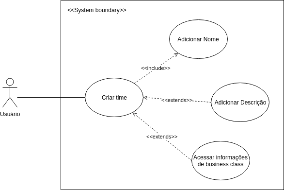

# Casos de uso
Diagramas de casos de uso, ou diagramas comportamentais na documentação UML, são responsáveis por descrever as principais funcionalidades do sistema e a interação dessas funcionalidades com os usuários do próprio sistema.
Para tal, o diagrama dispõe de atores que representam usuários ou sistemas que interagem com o sistema em questão, elipses que representam ações e relações entre as elipses, que podem ser do tipo include ou extend.

## Diagramas:

### Caso 5: Criar time

### UC01 - Criar time

### Descrição
* Tem como objetivo a criação de um time para melhorar a organização de quadros e arquivos que devem pertencer a um grupo específico de usuários.

### Atores
* Usuário

### Pré Condições
* O usuário deve estar logado  no sistema.

### Fluxo Principal
* FP01 - Criar time
1. Usuário acessa a opção de criar time.
2. Usuário digita o nome do time. [UC02][FA01][FA02]
3. Time criado com sucesso. Usuário é redirecionado para página do time.

### Fluxos Alternativos
* FA01 - Adicionar descrição
1. Usuário adiciona descrição do time [UC03]

* FA02 - Acessar informações de business class
1. Usuário acessa informações do business class [UC04]

### Fluxos de Exceção
* Não se aplica.
    
### Pós Condições
* Time é criado com informações dadas pelo usuário.

### UC02 - Adicionar nome

### Descrição
* Permite nomear times criados pelo usuário.

### Atores
* Usuário

### Pré Condições
* O usuário deve estar logado  no sistema.
* Formulário de criação de time deve estar selecionado.

### Fluxo Principal
* FP01 - Criar time
1. Usuário digita o nome do time.
2. Usuário clica em no botão "criar".
3. Time criado com sucesso. Usuário é redirecionado para página do time.

### Fluxos Alternativos
* Não se aplica.

### Fluxos de Exceção
* Não se aplica.
    
### Pós Condições
* Time é criado com informações dadas pelo usuário.

### UC03 - Adicionar descrição

### Descrição
* Permite nomear times criados pelo usuário.

### Atores
* Usuário

### Pré Condições
* O usuário deve estar logado  no sistema.
* Formulário de criação de time deve estar selecionado.

### Fluxo Principal
* FP01 - Criar time
1. Usuário digita o nome do time.
2. Usuário digita descrição do time.
2. Usuário clica em no botão "criar".
3. Time criado com sucesso. Usuário é redirecionado para página do time.

### Fluxos Alternativos
* Não se aplica.

### Fluxos de Exceção
* Não se aplica.
    
### Pós Condições
* Time é criado com informações dadas pelo usuário.

### UC04 - Acessar informações de business class

### Descrição
* Permite ter acesso a informações relevantes sobre as vantagens da assinatura do plano de business class.

### Atores
* Usuário

### Pré Condições
* O usuário deve estar logado  no sistema.
* Formulário de criação de time deve estar selecionado.

### Fluxo Principal
* FP01 - Criar time
1. Usuário clica "saiba mais" no texto referente ao business class.
2. Nova guia do navegador é aberta contendo informações referentes ao business class.

### Fluxos Alternativos
* Não se aplica.

### Fluxos de Exceção
* Não se aplica.
    
### Pós Condições
* Usuário tem acesso a todas informações relevantes sobre business class disponíveis no sistema.