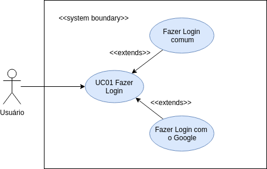
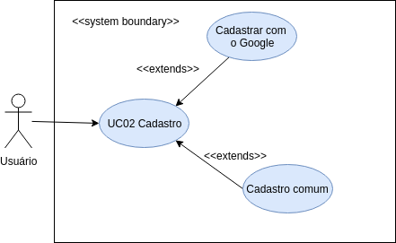
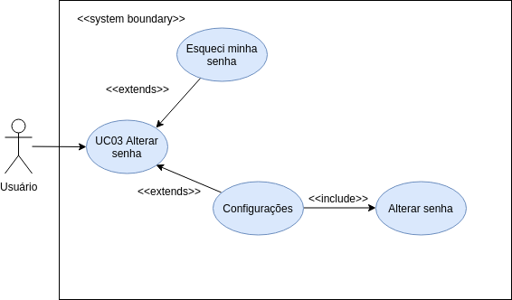
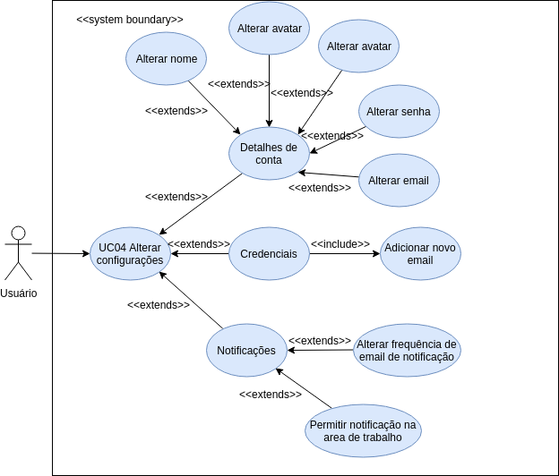

# Casos de uso
Diagramas de casos de uso, ou diagramas comportamentais na documentação UML, são responsáveis por descrever as principais funcionalidades do sistema e a interação dessas funcionalidades com os usuários do próprio sistema.
Para tal, o diagrama dispõe de atores que representam usuários ou sistemas que interagem com o sistema em questão, elipses que representam ações e relações entre as elipses, que podem ser do tipo include ou extend.

## Diagramas:

### Caso 1: Fazer Login

### UC01 - Fazer Login

|  |  |
|  ------: | :------ |
|  **Descrição** | Tem como objetivo Ter acesso a seus boards e times. |
| **Atores** | Usuário |
| **Pré Condições** | Usuário deve possuir cadastro no sistema. |
| **Fluxo Principal** | **FP01 - Fazer Login** 1. Abre a página inicial do trello. 2. Usuário clica no botão “Fazer Login”. 3. Usuário informa seu e-mail e senha. 4. Usuário clica no botão “Fazer Login”. 5. Caso de uso encerrado. |
| **Fluxos Alternativos** | **FA01 - Alterar senha [UC03]** 1. Abre a página de Login. 2. Usuário clica no link “Esqueceu sua senha?”. 3. Usuário digita seu “Email”. 4. Usuário clica no botão “Enviar”. 5. Usuário recebe um e-mail para redefinir sua senha.  6. Usuário abre o e-mail recebido. 7. Usuário clica no botão “Redefinir Senha”. 8. Usuário insere a nova senha. 9. Usuário insere a nova senha novamente. 10. Usuário clica no botão ‘Enviar’. 11. Usuário retorna para o primeiro passo do fluxo principal. **FA02 - Fazer Login com o Google** 1. Abre a página inicial do trello. 2. Usuário clica no botão “Fazer Login”. 3. Usuário clica no botão “Fazer Login com o Google”. 4. Usuário insere o endereço de e-mail ou telefone. 5. Usuário clica no botão “Próxima”. 6. Usuário insere a senha. 7. Usuário clica no botão “Próxima”. 8. Usuário estará logado na aplicação. 9. Caso de uso encerrado. |
| **Fluxos de Exceção** | Não se aplica. |
| **Pós Condições** | Usuário estará logado no sistema. |

### Caso 2: Cadastro

### UC02 - Cadastro

|  |  |
|  ------: | :------ |
|  **Descrição** | Tem como objetivo criar uma nova conta no sistema. |
| **Atores** | Usuário |
| **Pré Condições** | Usuário deve possuir email. |
| **Fluxo Principal** | **FP01 - Cadastro** 1. Abre a página inicial do trello. 2. Usuário clica no botão “Cadastre-se”. 3. Usuário informa seu nome, e-mail e senha. 4. Usuário clica no botão “Criar Nova Conta”. 5. Caso de uso encerrado. |
| **Fluxos Alternativos** | **FA01 - Fazer Cadastro com o Google** 1. Abre a página de Login. 2. Usuário clica no botão “Cadastre-se”. 3. Usuário clica no botão “Cadastre-se com o Google”. 4. Usuário insere o endereço de e-mail. 5. Usuário clica no botão “Próxima”.  6. Usuário insere a senha. 7. Usuário clica no botão “Próxima”. 8. Caso de uso encerrado. |
| **Fluxos de Exceção** | Não se aplica. |
| **Pós Condições** | Usuário terá criado uma nova conta no sistema. |

### Caso 3: Alterar Senha

### UC03 - Alterar Senha

|  |  |
|  ------: | :------ |
|  **Descrição** | Tem como objetivo alterar senha de uma conta existente. |
| **Atores** | Usuário |
| **Pré Condições** | Usuário deve possuir uma conta. |
| **Fluxo Principal** | **FP01 - Alterar Senha** 1. Abre a página inicial do trello. 2. Usuário clica no seu avatar. 3. Usuário clica em “Configurações”. 4. Usuário clica em “Alterar Senha…”. 5. Usuário informa sua senha atual e sua nova senha. 6. Usuário clica no botão “Salvar”. 7. Caso de uso encerrado. |
| **Fluxos Alternativos** | **FA01 - Esqueci minha senha** 1. Abre a página de Login. 2. Usuário clica no link “Esqueceu sua senha?”. 3. Usuário digita seu “Email”. 4. Usuário clica no botão “Enviar”. 5. Usuário recebe um e-mail para redefinir sua senha.  6. Usuário abre o e-mail recebido. 7. Usuário clica no botão “Redefinir Senha”. 8. Usuário insere a nova senha. 9. Usuário insere a nova senha novamente. 10. Usuário clica no botão ‘Enviar’. 11. Caso de uso encerrado. |
| **Fluxos de Exceção** | Não se aplica. |
| **Pós Condições** | Usuário terá alterado a senha de sua conta no sistema. |

### Caso 4: Alterar Configurações

### UC04 - Alterar Configurações

|  |  |
|  ------: | :------ |
|  **Descrição** | Tem como objetivo alterar configurações, tanto do trello quanto da conta. |
| **Atores** | Usuário |
| **Pré Condições** | Usuário deve possuir uma conta. |
| **Fluxo Principal** | **FP01 - Alterar Configurações** 1. Abre a página inicial do trello estando logado. 2. Usuário clica no seu avatar. 3. Usuário clica em “Configurações”. 4. Caso de uso encerrado. |
| **Fluxos Alternativos** | **FA01 - Alterar nome** 1. A partir do passo 3 do fluxo principal. 2. Usuário clica no link “Alterar Nome, Iniciais ou Biografia...”. 3. Usuário digita os dados a serem editados. 4. Usuário clica no botão “Salvar”. 5. Caso de uso encerrado. **FA02 - Alterar Senha [UC04]** 1. A partir do passo 3 do fluxo principal. 2. Usuário clica no link “Alterar Senha...”. 3. Usuário digita os dados exigidos. 4. Usuário clica no botão “Salvar”. 5. Caso de uso encerrado. **FA03 - Alterar avatar** 1. A partir do passo 3 do fluxo principal. 2. Usuário clica no link “Alterar Avatar...”. 3. Usuário escolhe a nova imagem. 4. Caso de uso encerrado. **FA04 - Alterar email** 1. A partir do passo 3 do fluxo principal. 2. Usuário clica no link “Alterar Email...” 3. Usuário digita o novo email. 4. Usuário clica no botão “Alterar E-mail”. 5. Caso de uso encerrado. **FA05 - Adicionar novo email** 1. A partir do passo 3 do fluxo principal. 2. Usuário clica no botão “Adicionar novo endereço de email”. 3. Usuário digita o novo email. 4. Usuário clica no botão “Enviar Email de Confirmação”. 5. Caso de uso encerrado. **FA06 - Alterar frequência de email de notificação** 1. A partir do passo 3 do fluxo principal. 2. Usuário clica no botão “Alterar frequência de email de notificação”. 3. Usuário escolhe a opção desejada. 4. Caso de uso encerrado. **FA07 - Permitir notificações da Área de Trabalho** 1. A partir do passo 3 do fluxo principal. 2. Usuário clica no botão “Permitir Notificações da Área de Trabalho”. 3. Caso de uso encerrado. |
| **Fluxos de Exceção** | Não se aplica. |
| **Pós Condições** | Usuário terá alterado as configurações de sua conta no sistema. |

### Caso 5: Criar time

#### UC01 - Criar time

|  |  |
|  ------: | :------ |
|  **Descrição** | Tem como objetivo a criação de um time para melhorar a organização de quadros e arquivos que devem pertencer a um grupo específico de usuários. |
| **Atores** | Usuário |
| **Pré Condições** | O usuário deve estar logado no sistema. |
| **Fluxo Principal** | **FP01 - Criar time** 1. Usuário acessa a opção de criar time. 2. Aciona UC02 - Adicionar nome. [FA01][FA02] 3. Time criado com sucesso. Usuário é redirecionado para página do time. |
| **Fluxos Alternativos** | **FA01 - Adicionar descrição** [UC03]. **FA02 - Acessar informações de business class** [UC04] |
| **Fluxos de Exceção** | Não se aplica. |
| **Pós Condições** | Time é criado com informações dadas pelo usuário. |

#### UC02 - Adicionar nome

|  |  |
|  ------: | :------ |
|  **Descrição** | Permite nomear times criados pelo usuário. |
| **Atores** | Usuário |
| **Pré Condições** | O usuário deve estar logado no sistema.  Formulário de criação de time deve estar selecionado.|
| **Fluxo Principal** | **FP01 - Adicionar nome** 1. Usuário digita o nome do time. 2. Usuário clica em no botão "criar".  3. Retorna para UC01 - criar time, passo 3. |
| **Fluxos Alternativos** | Não se aplica. |
| **Fluxos de Exceção** | Não se aplica. |
| **Pós Condições** | Time é criado com informações dadas pelo usuário. |

#### UC03 - Adicionar descrição

|  |  |
|  ------: | :------ |
|  **Descrição** | Permite adicionar descrição a times criados pelo usuário. |
| **Atores** | Usuário |
| **Pré Condições** | O usuário deve estar logado no sistema.  Formulário de criação de time deve estar selecionado.|
| **Fluxo Principal** | **FP01 - Adicionar descrição** 1. Usuário digita o nome do time. 2. Usuário digita descrição do time. 3. Usuário clica em no botão "criar".  4. Retorna para UC01 - criar time, passo 3. |
| **Fluxos Alternativos** | Não se aplica. |
| **Fluxos de Exceção** | Não se aplica. |
| **Pós Condições** | Time é criado com informações dadas pelo usuário. |

#### UC04 - Acessar informações de business class

|  |  |
|  ------: | :------ |
|  **Descrição** | Permite ter acesso a informações relevantes sobre as vantagens da assinatura do plano de business class. |
| **Atores** | Usuário |
| **Pré Condições** | O usuário deve estar logado no sistema.  Formulário de criação de time deve estar selecionado.|
| **Fluxo Principal** | **FP01 - Acessar informações de business class** 1. Usuário clica "saiba mais" no texto referente ao business class. 2. Nova guia do navegador é aberta contendo informações referentes ao business class.  |
| **Fluxos Alternativos** | Não se aplica. |
| **Fluxos de Exceção** | Não se aplica. |
| **Pós Condições** | Time é criado com informações dadas pelo usuário. |

### Caso 6: Adicionar/remover membros de time

#### UC01 - Acessar lista de membros

|  |  |
|  ------: | :------ |
|  **Descrição** | Permite ao usuário visualizar todos os membros de um time e suas permissões. |
| **Atores** | Administrador Usuário |
| **Pré Condições** | O administrador do time deve estar logado no sistema. |
| **Fluxo Principal** | **FP01 - Acessar lista de membros** 1. Usuário clica no time que deseja visualizar dentre os presentes no menu lateral. 2. O usuário clica em membros. 3. Sistema mostra lista de membros do time. [FE01][FA01][FA02] |
| **Fluxos Alternativos** | **FA01 - Remover membro** [UC02]. **FA02 - Convidar membro** [UC03] |
| **Fluxos de Exceção** | Não há membros no time. [UC03] |
| **Pós Condições** | Lista de membros do time é acessada pelo usuário |

#### UC02 - Remover membro

|  |  |
|  ------: | :------ |
|  **Descrição** | Permite ao usuário remover membros de um time. |
| **Atores** | Administrador Usuário |
| **Pré Condições** | O administrador do time deve estar logado no sistema.  O usuário deve pertencer ao time.|
| **Fluxo Principal** | **FP01 - Remover membro** 1. O administrador do time clica em remover, logo a frente do nome do usuário e confirma. [FE01] 2. Sistema retorna mensagem de confirmação de remoção e atuliza lista. |
| **Fluxos Alternativos** | Não se aplica |
| **Fluxos de Exceção** | Não há membros no time. |
| **Pós Condições** | Membro é removido do time e lista de membros é atualizada. |

#### UC03 - Convidar membro

|  |  |
|  ------: | :------ |
|  **Descrição** | Permite ao usuário convidar membros para um time. |
| **Atores** | Administrador Usuário |
| **Pré Condições** | O administrador do time deve estar logado no sistema.  O usuário deve possuir conta no trello.|
| **Fluxo Principal** | **FP01 - Convidar membro** 1. Sistema mostra lista de membros do time.[FE01]  2. O administrador do time clica em Convidar membros do time 3. Aciona UC04 - convidar por email/nome de usuário.[FA01][FA02] 4. Lista de membro é atualizada com o(s) novo(s) membro(s). |
| **Fluxos Alternativos** | **FA01 - Enviar link de convite** [UC05]. **FA02 - Adicionar várias pessoas** [UC06] |
| **Fluxos de Exceção** | Não há membros no time. Redireciona para passo 3. |
| **Pós Condições** | Membro é adicionado ao time. |

#### UC04 - Convidar por email/nome de usuário 

|  |  |
|  ------: | :------ |
|  **Descrição** | Permite ao administrador do time convidar membros para um time através de seu email ou nome de usuário. |
| **Atores** | Administrador Usuário |
| **Pré Condições** | O administrador do time deve estar logado no sistema.  O usuário deve possuir conta no trello.|
| **Fluxo Principal** | **FP01 - convidar por email/nome de usuário** 1. Administrador do time digita nome de usuário ou email no formulário 2. Administrador clica em Adicionar ao time. 3. Retorna para UC03 - Convidar membro, passo 4. |
| **Fluxos Alternativos** | Não se aplica. |
| **Fluxos de Exceção** | Não se aplica. |
| **Pós Condições** | Membro é adicionado ao time. |

#### UC05 - Enviar link de convite

|  |  |
|  ------: | :------ |
|  **Descrição** | Permite ao administrador do time convidar membros através da criação de link. |
| **Atores** | Administrador Usuário |
| **Pré Condições** | O administrador do time deve estar logado no sistema.  O usuário deve possuir conta no trello.|
| **Fluxo Principal** | **FP01 - convidar por email/nome de usuário** 1. Administrador do time clica em criar link. 2. Administrador do time clica em copiar. 3. Administrador envia link para usuários de sua escolha. |
| **Fluxos Alternativos** | Não se aplica. |
| **Fluxos de Exceção** | Não se aplica. |
| **Pós Condições** |Link de acesso ao grupo é criado. |

#### UC06 - Adicionar várias pessoas

|  |  |
|  ------: | :------ |
|  **Descrição** | Permite ao administrador do time convidar mais de um membro por vez. |
| **Atores** | Administrador Usuário |
| **Pré Condições** | O administrador do time deve estar logado no sistema.  O usuário deve possuir conta no trello.|
| **Fluxo Principal** | **FP01 - convidar por email/nome de usuário** 1. Administrador do time clica em Adicionar várias pessoas de uma vez. 2. Administrador do time insere todos os emails e nomes de usuário que deseja adicionar no time. 3. Administrador clica em Adicionar eo time. 4. Retorna para UC03 - Convidar membro, passo 4 |
| **Fluxos Alternativos** | Não se aplica. |
| **Fluxos de Exceção** | Não se aplica. |
| **Pós Condições** |Link de acesso ao grupo é criado. |

### Caso 7: Alterar configurações de time

.png)

#### UC01 - Acessar configurações de time

|  |  |
|  ------: | :------ |
|  **Descrição** | Tem como objetivo permitir o acesso às configurações de um time para alteração ou simples visualização. |
| **Atores** | Usuário |
| **Pré Condições** | O usuário deve estar logado no sistema. Usuário deve ser membro do time. |
| **Fluxo Principal** | **FP01 - Acessar configurações de time** 1. Usuário clica no time que deseja visualizar dentre os presentes no menu lateral. 2. O usuário clica em configurações. 3. Sistema mostra configurações do time. [FA01] 4. Aciona UC03 - Alterar visibilidade do time. 5. Aciona UC04 - Vincular time do slack. |
| **Fluxos Alternativos** | **FA01 - Editar perfil** [UC02]. |
| **Fluxos de Exceção** | Não se aplica. |
| **Pós Condições** | Configurações são acecssadas pelo usuário. |

#### UC02 - Editar perfil

|  |  |
|  ------: | :------ |
|  **Descrição** | Tem como objetivo editar informações básicas de um time. |
| **Atores** | Usuário |
| **Pré Condições** | O usuário deve estar logado no sistema. Usuário deve ser administrador do time. |
| **Fluxo Principal** | **FP01 - Editar perfil** 1. Usuário clica em editar perfil do time. 2. O usuário altera as informações de perfil. 3. O usuário clica em salvar 4. Aciona UC01 - Acessar configurações de time, passo 3. |
| **Fluxos Alternativos** | Não se aplica. |
| **Fluxos de Exceção** | Não se aplica. |
| **Pós Condições** | Informações de perfil de time devem ser atualizadas. |

#### UC03 - Alterar visibilidade do time

|  |  |
|  ------: | :------ |
|  **Descrição** | Permite alterar nível de visibilidade do time (público ou particular). |
| **Atores** | Usuário |
| **Pré Condições** | O usuário deve estar logado no sistema. Usuário deve ser administrador do time. |
| **Fluxo Principal** | **FP01 - Alterar visibilidade do time** 1. Usuário clica em alterar, que se encontra a frente da visibilidade do time. 2. O usuário seleciona a visibilidade que deseja para o time. 3. O usuário clica em salvar 4. Aciona UC01 - Acessar configurações de time, passo 3. |
| **Fluxos Alternativos** | Não se aplica. |
| **Fluxos de Exceção** | Não se aplica. |
| **Pós Condições** | Visibilidade do time deve ser atualizada. |

#### UC04 - Vincular time do slack

|  |  |
|  ------: | :------ |
|  **Descrição** | Permite vincular time do trello com time do slack, facilitando a comunicação com o grupo. |
| **Atores** | Usuário |
| **Pré Condições** | O usuário deve estar logado no sistema. Usuário deve ser administrador do time. |
| **Fluxo Principal** | **FP01 - Vincular time do slack** 1. Usuário clica em add to Slack. [FA01] 2. O usuário informa o nome do workspace do slack. 3. Sistema retorna página de termos 4. Usuário autoriza vinculação. 5. Aciona UC01 - Acessar configurações de time, passo 3. |
| **Fluxos Alternativos** |  **FA01 - Acessar informações de vinculação** [UC05] |
| **Fluxos de Exceção** | Não se aplica. |
| **Pós Condições** | Time deve ser vinculado ao slack. |

#### UC05 - Acessar informações de vinculação

|  |  |
|  ------: | :------ |
|  **Descrição** | Permite ao usuário entender quais as vantagens de se vincular o time do trello com o time do slack. |
| **Atores** | Usuário |
| **Pré Condições** | O usuário deve estar logado no sistema. Usuário deve ser membro do time. |
| **Fluxo Principal** | **FP01 - Acessar informações de vinculação** 1. Usuário clica em saiba mais na sessão vinculação ao slack. 2. Sistema redireciona para página de informações de vinculação ao slack. |
| **Fluxos Alternativos** | Não se aplica. |
| **Fluxos de Exceção** | Não se aplica. |
| **Pós Condições** | Usuário tem acesso a informações relevantes sobre vinculação com trello |

### Caso 8:  Alterar configurações de board

#### UC01 - Acessar board

|  |  |
|  ------: | :------ |
|  **Descrição** | Tem como objetivo permitir o acesso boards dos quais participa. |
| **Atores** | Usuário |
| **Pré Condições** | O usuário deve estar logado no sistema.  |
| **Fluxo Principal** | **FP01 - Acessar configurações de time** 1. Usuário clica em boards no menu lateral ou no header. 2. O sistema retorna lista de boards que o usuário participa. 3. Usuário seleciona board. [FE01] 4. sistema redireciona para página do board selecionado. 5. Aciona UC05 - Visualizar atividade. [FA01][FA02][FA03] |
| **Fluxos Alternativos** | **FA01 - Acessar mais opções do menu** [UC02]. **FA02 - Alterar tela de fundo** [UC03]. **FA01 - Adicionar/remover power-up** [UC04]. |
| **Fluxos de Exceção** | Usuário não participa de nenhum board. |
| **Pós Condições** | Usuário tem acesso aos dados do board. |

#### UC02 - Acessar mais opções do menu

|  |  |
|  ------: | :------ |
|  **Descrição** | Tem como objetivo permitir o acesso a configurações do board selecionado. |
| **Atores** | Usuário |
| **Pré Condições** | O usuário deve estar logado no sistema. |
| **Fluxo Principal** | **FP01 - Acessar mais opções do menu** 1. Usuário clica em mostrar menu caso menu não esteja aberto. 2. Usuário clica em mais. 3. O sistema retorna mais opções para o menu |
| **Fluxos Alternativos** | Não se aplica. |
| **Fluxos de Exceção** | Usuário não participa de nenhum board. |
| **Pós Condições** | Usuário tem acesso aos dados do board. |

#### UC03 - Alterar tela de fundo

|  |  |
|  ------: | :------ |
|  **Descrição** | Tem como objetivo permitir a estilização do board. |
| **Atores** | Usuário |
| **Pré Condições** | O usuário deve estar logado no sistema. O usuário deve ser membro do board. |
| **Fluxo Principal** | **FP01 - Alterar tela de fundo** 1. Usuário clica em mostrar menu caso menu não esteja aberto. 2. Usuário clica em Alterar tela de fundo. 3. O sistema retorna opções de tela de fundo. 4. Usuário seleciona entre as cores e fotos disponíveis. |
| **Fluxos Alternativos** | Não se aplica. |
| **Fluxos de Exceção** | Não se aplica. |
| **Pós Condições** | Tela de fundo do board é alterada. |

#### UC04 - Adicionar/remover power-ups

|  |  |
|  ------: | :------ |
|  **Descrição** | Tem como objetivo editar os power-ups de um board. |
| **Atores** | Usuário |
| **Pré Condições** | O usuário deve estar logado no sistema. O usuário deve ser membro do board. |
| **Fluxo Principal** | **FP01 - Adicionar/remover power-ups** 1. Usuário clica em mostrar menu caso menu não esteja aberto. 2. Usuário clica em Power-ups. 3. O sistema retorna opções de power-ups que podem ser adicionados ao board. 4. Usuário seleciona entre os power-ups disponíveis. |
| **Fluxos Alternativos** | Não se aplica. |
| **Fluxos de Exceção** | Não se aplica. |
| **Pós Condições** | Power-ups do board são atualizados. |

### Caso 10: Board

### UC01 - Criar Board
### Descrição
- Criar um board para planejamento de projeto ou uso da maneira que melhor se enquadra ao contexto do usuário.

### Atores
- Usuário.

### Pré Condições
- O usuário deve estar logado na aplicação e possuir acesso a internet.

### Pós Condições
- O usuário terá um board para seu projeto, pessoal ou em grupo, para se organizar.
### Fluxo Principal
- O usuário loga na aplicação
- O usuário clical em criar Board

### Fluxos de Exceção
- O usuário ser convidado para um Board.
- O usuário criar um time.

### UC02 - Ver um Board
### Descrição
- Ter uma visão macro do board.

### Atores
- Usuário.

### Pré Condições
- O usuário deve estar logado na aplicação e possuir acesso a internet, possuir ou estar vinculado a um board para visualizá-lo.

### Pós Condições
- O usuário poderá ver o board de forma macro, como cards e colunas vinculadas.

### Fluxo Principal
- O usuário loga na aplicação
- O usuário clical em um board que deseja visualizar
- O usuário visualiza o board

### Fluxos de Exceção
- O usuário ter imprimido o board anteriormente, poderá visualizá-lo sem a necessidade de entrar na aplicação.

### UC03 - Seguir um Board
### Descrição
- Ter um vinculo a um board para poder acompanhar toda e qualquer alteração realizada no board.

### Atores
- Usuário

### Pré Condições
- O usuário deve estar logado na aplicação e possuir acesso a internet, possuir ou estar vinculado a um board.

### Pós Condições
- O usuário poderá receber notificações sempre que ocorrer alguma alteração no board que está seguindo.

### Fluxo Principal
- O usuário loga na aplicação
- O usuário clica em um board
- O usuário clica em “mais” no menu
- O usuário clica em seguir

### Fluxos de Exceção
- Falta de internet, fazendo com que apareça a mensagem de erro

### UC04 - Adicionar membros em um Board
### Descrição
- Vincular membros a que contribuam ou não para o contexto do board.

### Atores
- Usuário

### Pré Condições
- O usuário deve estar logado na aplicação e possuir acesso a internet, possuir ou estar vinculado a um board.

### Pós Condições
- O usuário terá outras pessoas que podem editar e realizar atividades no board e atreladas ao board.

### Fluxo Principal
- O usuário loga na aplicação
- O usuário clica em um board
- O usuário clica em adicionar membros

### Fluxos de Exceção
- Após logar na aplicação o usuário pode criar um time
- O usuário irá poder adicionar os membros e entrar no novo board criado
- Ao clicar em adicionar membros o usuário pode convidar pelo e-mail
- Ao clicar em adicionar membros o usuário pode convidar pela conta trello

### UC05 - Imprimir um Board
### Descrição
- Ter impresso a visão macro de um board.

### Atores
- Usuário

### Pré Condições
- O usuário deve estar logado na aplicação e possuir acesso a internet, ter acesso a uma impressora, possuir ou estar vinculado a um board.

### Pós Condições
- O usuário terá em suas mãos uma versão impressa da versão macro do board.

### Fluxo Principal
- O usuário loga na aplicação
- O usuário clica em um board
- O usuário clica em imprimir board

### Fluxos de Exceção
- Falta de internet, apresentando a mensagem de erro ao usuário
- Falha na conexão com a impresora que irá imprimir o board.

### UC06 - Ser convidado para um Board
### Descrição
- Ter recebido um convite para participação de um board.

### Atores
- Usuário

### Pré Condições
- O usuário deve possuir uma conta de e-mail.

### Pós Condições
- O usuário terá um convite que lhe dá acesso a um board.

### Fluxo Principal
- O usuário confirma o convite

### Fluxos de Exceção
- Falta de internet, apresentando a mensagem de erro ao usuário.
- O usuário não apresenta interesse.

### UC07 - Criar um time
### Descrição
- Ter um time para designar e coordenar tarefas, de acordo com o contexto do usuário.

### Atores
- Usuário

### Pré Condições
- O usuário deve estar logado na aplicação e possuir acesso a internet.

### Pós Condições
- O usuário terá um board com um time vinculado.

### Fluxo Principal
- O usuário loga na aplicação
- O usuário clica em criar um time

### Fluxos de Exceção
- O usuário loga na aplicação
- O usuário clica em um board
- O usuário clica em adicionar membros

## UC08 - Convidar por E-mail
### Descrição
- Ter a possibilidade de convidar mais participantes para contribuírem com o contexto do board.

### Atores
- Usuário

### Pré Condições
- O usuário deve estar logado na aplicação e possuir acesso a internet, possuir ou estar vinculado a um board.

### Pós Condições
- O usuário terá enviado um convite para uma ou mais pessoas de colaboração.

### Fluxo Principal
- O usuário loga na aplicação
- O usuário clica em um board
- O usuário clica em adicionar membros
- O usuário escreve o e-mail do membro que quer adicionar

### Fluxos de Exceção
- Falta de internet, apresentando a mensagem de erro ao usuário.

### UC09 - Convidar pela Conta
### Descrição
- Ter a possibilidade de convidar mais participantes para contribuírem com o contexto do board.

### Atores
- Usuário

### Pré Condições
- O usuário deve estar logado na aplicação e possuir acesso a internet, possuir ou estar vinculado a um board.

### Pós Condições
- O usuário terá enviado um convite para uma ou mais pessoas de colaboração.

### Fluxo Principal
- O usuário loga na aplicação
- O usuário clica em um board
- O usuário clica em adicionar membros
- O usuário escreve nome da conta do membro que quer adicionar

### Fluxos de Exceção
- Falta de internet, apresentando a mensagem de erro ao usuário.

## UC10 - Fechar Board
### Descrição
- Ter a possibilidade de fechar o board, para finalização do projeto que estava em andamento.

### Atores
- Usuário

### Pré Condições
- O usuário deve estar logado na aplicação e possuir acesso a internet, possuir ou estar vinculado a um board para que possa ser fechado.

### Pós Condições
- O usuário terá fechado o board da sua escolha.

### Fluxo Principal
- O usuário loga na aplicação
- O usuário clica em um board
- O usuário clica em fechar board

### Fluxos de Exceção
- Falta de internet, apresentando a mensagem de erro ao usuário.

### UC11 - Vincular Board
### Descrição
- Ter a possibilidade de vincular o board, para outro contexto.

### Atores
- Usuário

### Pré Condições
- O usuário deve estar logado na aplicação e possuir acesso a internet, possuir ou estar vinculado a um board.

### Pós Condições
- O usuário terá vinculado o seu board a um outro contexto, ligando ambos.

### Fluxo Principal
- O usuário loga na aplicação
- O usuário clica em um board
- O usuário gera o link para vincular o board

### Fluxos de Exceção
- Falta de internet, apresentando a mensagem de erro ao usuário.

## UC22 - Modificar um Card

| **Descrição** | Eu, como usuário, desejo poder modificar um ou mais atributos de um card existente.
| **Atores** | Usuário
| **Pré Condições** | O usuário deve estar logado na aplicação, possuir acesso a internet, possuir ou estar vinculado a um board, lista e card.
| **Pós Condições** | O usuário terá modificado algum atributo do card selecionado caso o modifique.
| **Fluxo Principal** | O usuário loga na aplicação.   O usuário clica em um card.   O usuário escolhe um dos atributos a ser modificado.
| **Fluxos Alternativos** | [UC25-Adicionar Membro](#uc25---adicionar-membro-a-um-card)   [UC26-Adicionar Descrição](#uc26---adicionar-descrição-a-um-card)   [UC27-Adicionar Checklist](#uc27---adicionar-check-list-a-um-card)   [UC28-Adicionar Etiqueta](#uc28---adicionar-etiqueta-a-um-card)   [UC29-Adicionar Deadline](#uc29---adicionar-deadline-a-um-card)   [UC32-Adicionar Anexo](#uc32---adicionar-anexo-a-um-card)   [UC35-Adicionar Power-Up](#uc35---adicionar-power-up)
| **Fluxos de Exceção** | Falta de internet, apresentando a mensagem de erro ao usuário.

## UC25 - Adicionar Membro a um Card

| **Descrição** | Ter a possibilidade de adicionar um membro a um card existente.
| **Atores** | Usuário.
| **Pré Condições** | O usuário deve estar logado na aplicação, possuir acesso a internet, possuir ou estar vinculado a um board, lista e card.
| **Pós Condições** | O usuário terá adicionado um novo membro caso o tenha feito.
| **Fluxo Principal** | O usuário loga na aplicação.   O usuário clica em um card.   O usuário clica em 'Adicionar Membro ao Card'.   O usuário escolhe o membro da board a ser adicionado ao card.
| **Fluxos de Exceção** |Falta de internet, apresentando a mensagem de erro ao usuário.

## UC26 - Adicionar Descrição a um Card

| **Descrição** | Ter a possibilidade de adicionar a descrição a um card.
| **Atores** | Usuário.
| **Pré Condições** | O usuário deve estar logado na aplicação, possuir acesso a internet, possuir ou estar vinculado a um board, lista e card.
| **Pós Condições** | O usuário terá adicionado uma nova descrição caso o tenha feito.
| **Fluxo Principal** | O usuário loga na aplicação.   O usuário clica em um card.   O usuário clica em 'Adicionar Descrição ao Card'.   O usuário insere a nova descrição do card.
| **Fluxos de Exceção** |Falta de internet, apresentando a mensagem de erro ao usuário.

## UC27 - Adicionar Check-list a um Card

|  ------: | :------ |
| **Descrição** | Ter a possibilidade de adicionar a checklist a um card.
| **Atores** | Usuário.
| **Pré Condições** | O usuário deve estar logado na aplicação, possuir acesso a internet, possuir ou estar vinculado a um board, lista e card.
| **Pós Condições** | O usuário terá adicionado uma nova check-list caso a tenha feito.
| **Fluxo Principal** | O usuário loga na aplicação.   O usuário clica em um card.   O usuário clica em 'Adicionar Check-list ao Card'.   O usuário insere a nova check-list ao card.
| **Fluxos de Exceção** | Falta de internet, apresentando a mensagem de erro ao usuário.

## UC28 - Adicionar Etiqueta a um Card

|  ------: | :------ |
| **Descrição** | Ter a possibilidade de adicionar a etiqueta a um card existente.
| **Atores** | Usuário.
| **Pré Condições** | O usuário deve estar logado na aplicação, possuir acesso a internet, possuir ou estar vinculado a um board, lista e card.
| **Pós Condições** | O usuário terá adicionado uma nova etiqueta caso a tenha feito.
| **Fluxo Principal** | O usuário loga na aplicação.   O usuário clica em um card.   O usuário clica em 'Adicionar Etiqueta ao Card'.   O usuário insere a nova etiqueta ao card.
| **Fluxos de Exceção** | Falta de internet, apresentando a mensagem de erro ao usuário.

## UC29 - Adicionar Deadline a um Card

|  ------: | :------ |
| **Descrição** | Ter a possibilidade de adicionar a deadline a um card existente.
| **Atores** | Usuário.
| **Pré Condições** | O usuário deve estar logado na aplicação, possuir acesso a internet, possuir ou estar vinculado a um board, lista e card.
| **Pós Condições** | O usuário terá adicionado uma nova deadline caso a tenha feito.
| **Fluxo Principal** | O usuário loga na aplicação.   O usuário clica em um card.   O usuário clica em 'Adicionar Deadline ao Card'.   O usuário insere a nova deadline ao card.
| **Fluxos de Exceção** | Falta de internet, apresentando a mensagem de erro ao usuário.

## UC30 - Adicionar Comentário a um Card

|  ------: | :------ |
| **Descrição** | Ter a possibilidade de adicionar um comentário a um card.
| **Atores** | Usuário.
| **Pré Condições** | O usuário deve estar logado na aplicação, possuir acesso a internet, possuir ou estar vinculado a um board, lista e card.
| **Pós Condições** | O usuário terá adicionado um novo comentário caso a tenha feito.
| **Fluxo Principal** | O usuário loga na aplicação.   O usuário clica em um card.   O usuário clica no ícone de balão de fala.   O usuário insere o comentário.
| **Fluxos Alternativos** | O usuário loga na aplicação.   O usuário clica em um card.   O usuário clica no ícone de balão de fala.   O usuário clica em um comentário já existente.   O usuário insere um novo comentário respondendo o anterior.
| **Fluxos de Exceção** | Falta de internet, apresentando a mensagem de erro ao usuário.

### UC31 - Alterar permissão de comentário

|  |  |
|  ------: | :------ |
|  **Descrição** | Ter a possibilidade de alterar quem pode comentar em cards de um board.
|
| **Atores** | Usuário |
| **Pré Condições** | O usuário deve estar logado na aplicação e possuir acesso a internet e possuir um board.|
| **Fluxo Principal** | 1. O usuário loga na aplicação 2. O usuário clica em um board 3. O usuário clica no botão 'Mostrar menu'.  4. O usuário clica no botão 'Mais'.  5. O usuário clica no botão 'Configurações'.  6. O usuário seleciona as 'Permissões de comentário'.  7. O usuário escolhe as 'Permissões de comentário' desejadas.|
| **Fluxos Alternativos** | Não se aplica. |
| **Fluxos de Exceção** | Falta de internet, apresentando a mensagem de erro ao usuário.|
| **Pós Condições** | O usuário terá gerenciado quem pode comentar cards em um determinado board.|

## UC32 - Adicionar Anexo a um Card

|  ------: | :------ |
| **Descrição** | Ter a possibilidade de adicionar um anexo a um card.
| **Atores** | Usuário.
| **Pré Condições** | O usuário deve estar logado na aplicação, possuir acesso a internet, possuir ou estar vinculado a um board, lista e card.
| **Pós Condições** | O usuário terá adicionado um novo anexo caso a tenha feito.
| **Fluxo Principal** | O usuário loga na aplicação.   O usuário clica em um card.  O usuário clica em  'Adicionar Anexo'   O usuário insere o arquivo desejado.
| **Fluxos de Exceção** | Falta de internet, apresentando a mensagem de erro ao usuário.

### UC33 - Mover um card para outra list

|  |  |
|  ------: | :------ |
|  **Descrição** | Ter a possibilidade de mover um card de uma lista para outra, para outro contexto.|
| **Atores** | Usuário |
| **Pré Condições** | O usuário deve estar logado na aplicação e possuir acesso a internet, possuir ou estar vinculado a um board, e este board possuir 2 ou mais listas com ao menos 1 card em alguma delas.|
| **Fluxo Principal** | 1. O usuário loga na aplicação. 2. O usuário clica em um board. 3. O usuário arrasta o card desejado para outra lista.|
| **Fluxos Alternativos** | Não se aplica. |
| **Fluxos de Exceção** | Falta de internet, apresentando a mensagem de erro ao usuário.|
| **Pós Condições** | O usuário terá movido o card a uma outra lista.|

### UC34 - Compartilhar card

|  |  |
|  ------: | :------ |
|  **Descrição** | Ter a possibilidade de compartilhar um card.|
| **Atores** | Usuário |
| **Pré Condições** | O usuário deve estar logado na aplicação e possuir acesso a internet, possuir ou estar vinculado a um board, e este board possuir 1 ou mais listas com ao menos 1 card em alguma delas.|
| **Fluxo Principal** | 1. O usuário loga na aplicação. 2. O usuário clica em um board. 3. O usuário clica no card desejado. . 4. O usuário clica na opção 'Compartilhar e mais...'. . 5. O usuário terá um referencial do card .|
| **Fluxos Alternativos** | Não se aplica. |
| **Fluxos de Exceção** | Falta de internet, apresentando a mensagem de erro ao usuário.|
| **Pós Condições** | O usuário terá compartilhado o card. |

## UC35 - Adicionar Power-Up

|  ------: | :------ |
| **Descrição** | Ter a possibilidade de adicionar um power-up a um card.
| **Atores** | Usuário.
| **Pré Condições** | O usuário deve estar logado na aplicação, possuir acesso a internet, possuir ou estar vinculado a um board, lista e card.
| **Pós Condições** | O usuário terá adicionado um novo power-up no card.
| **Fluxo Principal** | O usuário loga na aplicação.   O usuário clica em um card.   O usuário clica em  'Adicionar Powe-Up'   O usuário seleciona o power-up desejado.
| **Fluxos de Exceção** | Falta de internet, apresentando a mensagem de erro ao usuário.   Caso não seja o primeiro power-up no card e o usuário não esteja em algum plano pago, não é possível adicionar outro power-up.
