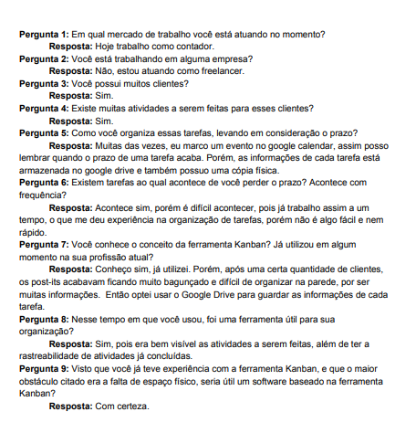

[Lista de Autores do artefato](/artefatos.html)

# Introdução

Foi elaborado uma entrevista com o intuito de entender dos problemas em que uma pessoa tem e que o trello se oferece a solucionar, como a entrevista pode possuir perguntas direcionadas ao caso do entrevistado, podemos também obter requisitos ao qual o sistema pode não possuir, sendo então uma proposta de melhora.

### Entrevista

A entrevista foi feita baseado em uma persona, onde não é citado diretamente a plataforma trello. As perguntas estão focadas no problema ao qual o trello oferece a solução, logo, com essa entrevista, é possivel observar o que o usuário espera ter em uma plataforma, assim podendo comparar o que o trello possui dessas necessidades e também o que ele deveria possuir.

### Resultados
É possivel observar que o trello supri a maioria das necessidades do entrevistado. Existe alguns problemas ao qual o trello não resolve diretamente,porém como ele possui uma API aberta, existe Power-Ups ao qual resolve esses problemas, no caso do entrevistado, seria a integração com o Google Calendar, Google Drive, etc.

## Conclusões

Foi possível levantar os seguintes requisitos a partir da entrevista:

| # | Requisito |
|  --: |   :-:  |
| 01 | Integração com software de terceiros. |
| 02 | Organização de tarefas. |
| 03 | Armazenamento de arquivos. |
| 04 | Usabilidade. |
| 05 | Notificações de prazos. |
| 06 | Imprimir um Card |
| 07 | Rastreabilidade |