[Lista de Autores do artefato](/artefatos.html)

# iStar

## SD01 - Time

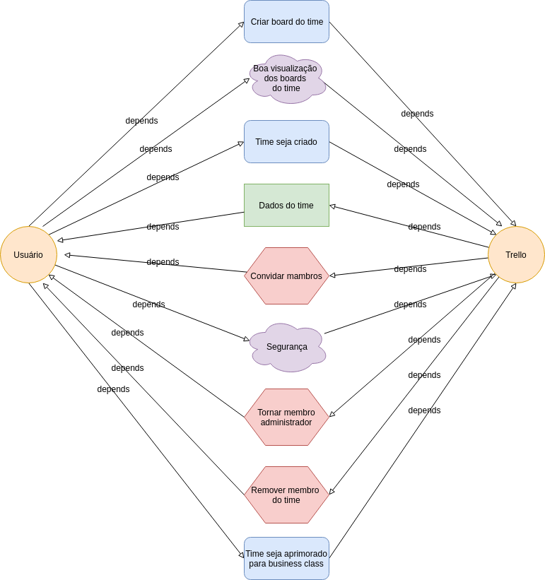

## SR - Time

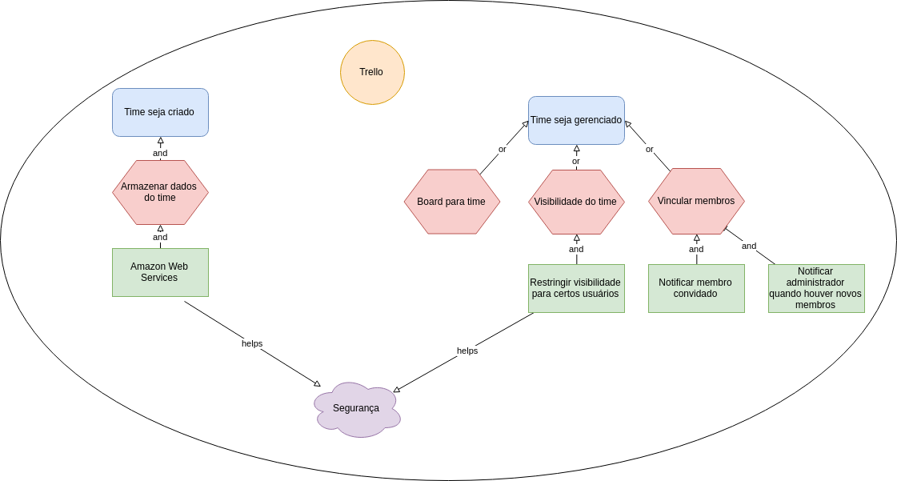

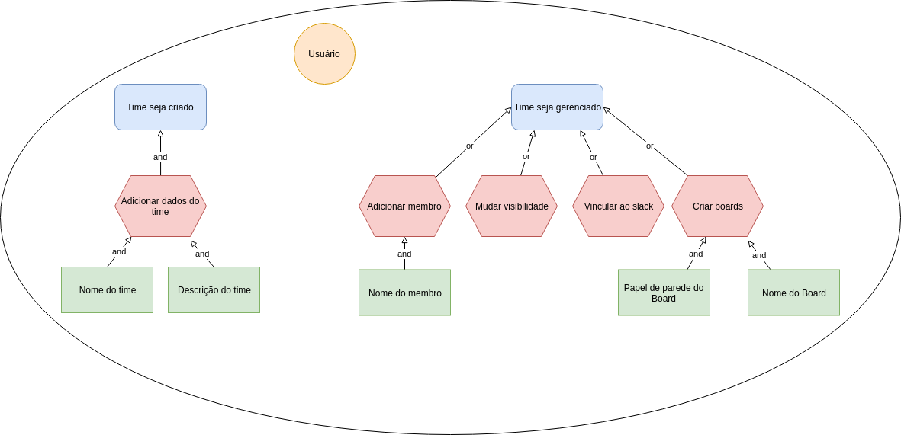

## SD02 - Board

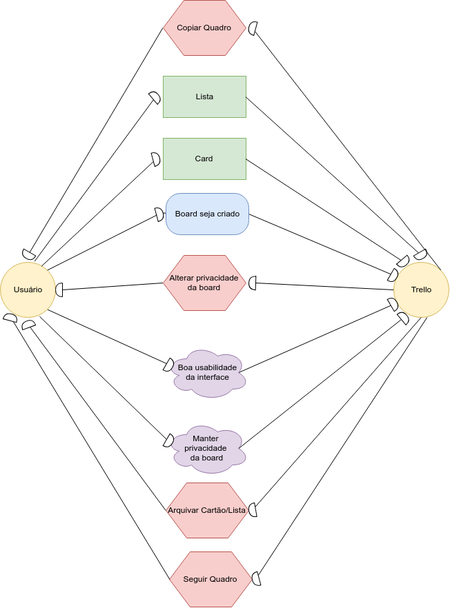

## SR - Board

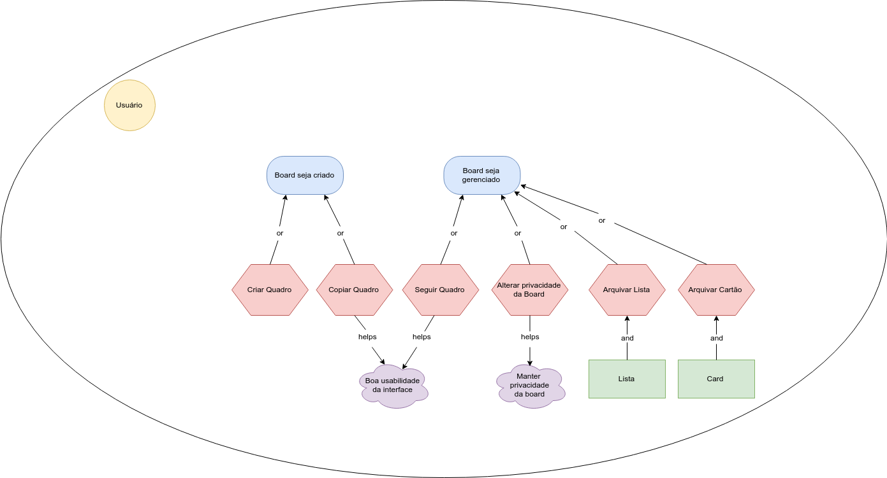

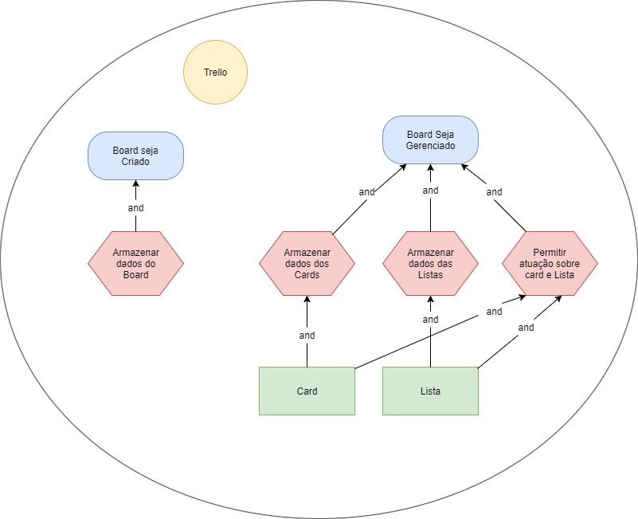

## SD03 - Busca

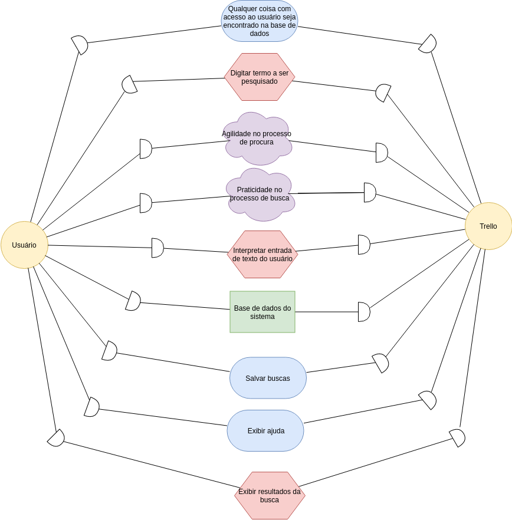

## SR - Busca

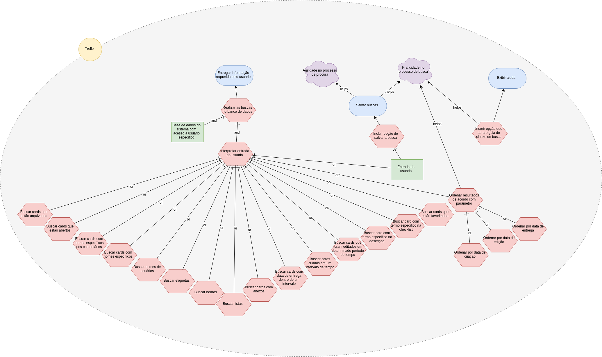

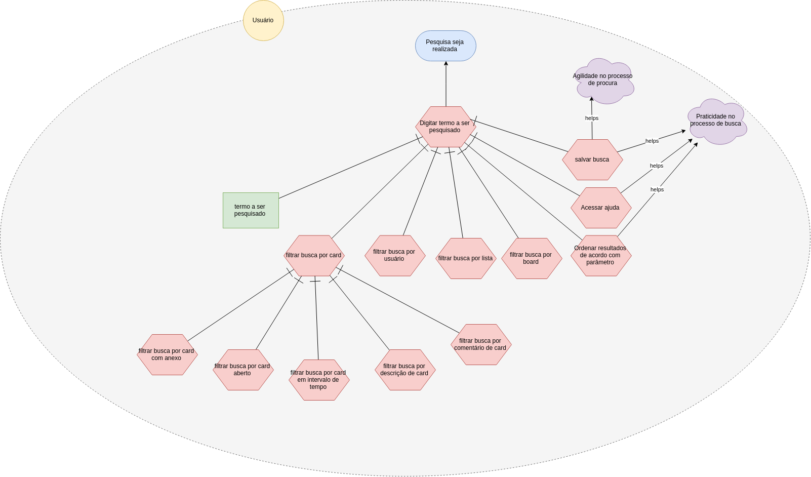

## SD04 - Card

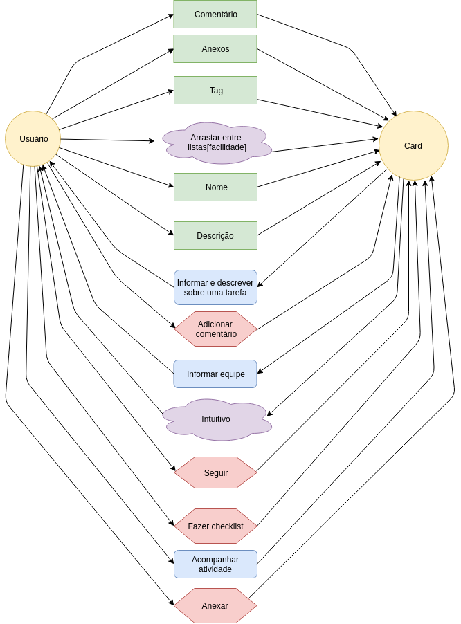

## SR - Card

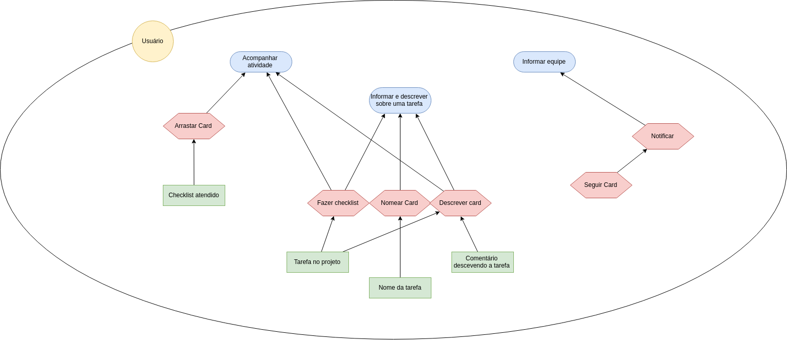

## SD05 - Filtrar Card

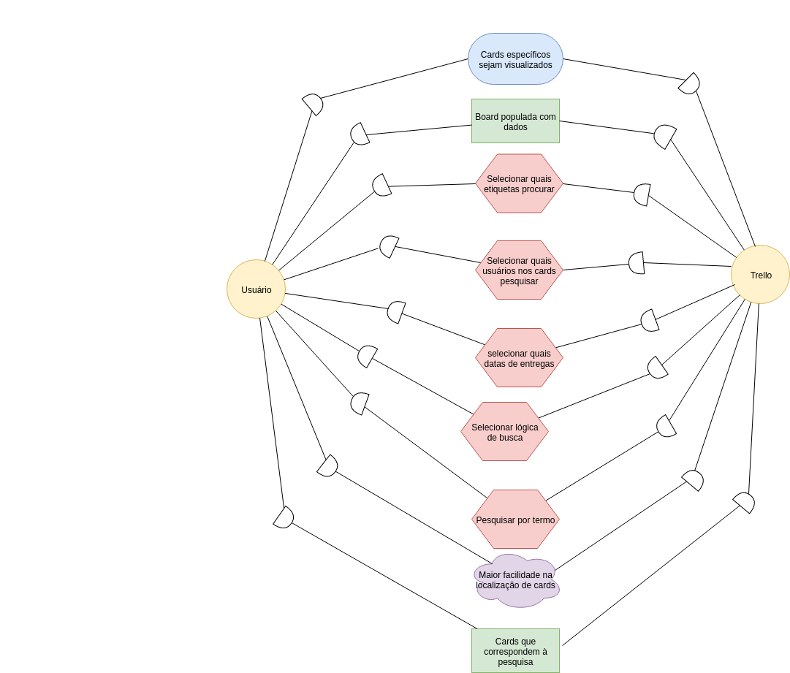

## SR - Filtrar Card

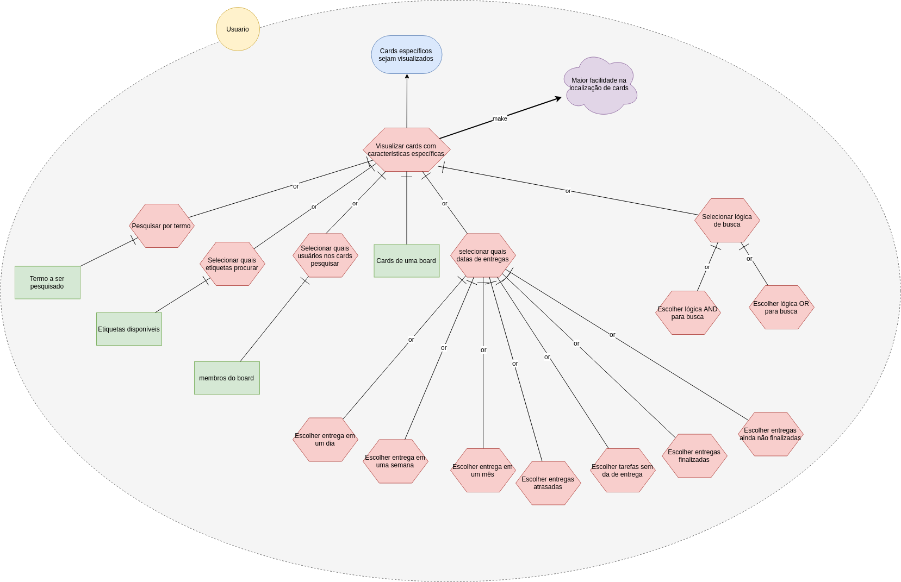

### Versão 1

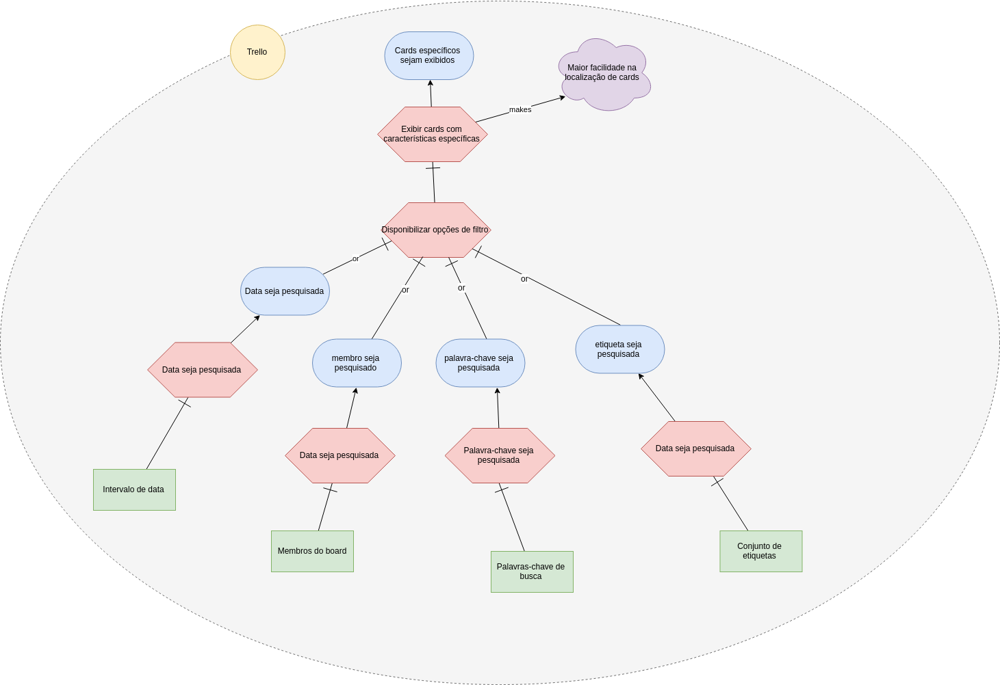

### Versão 2

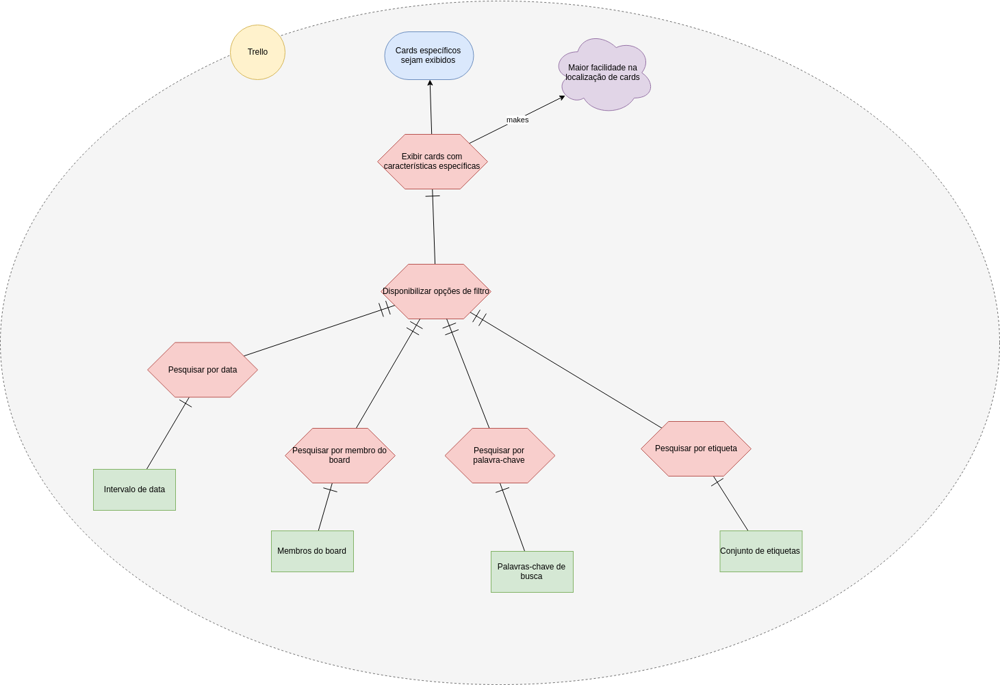

