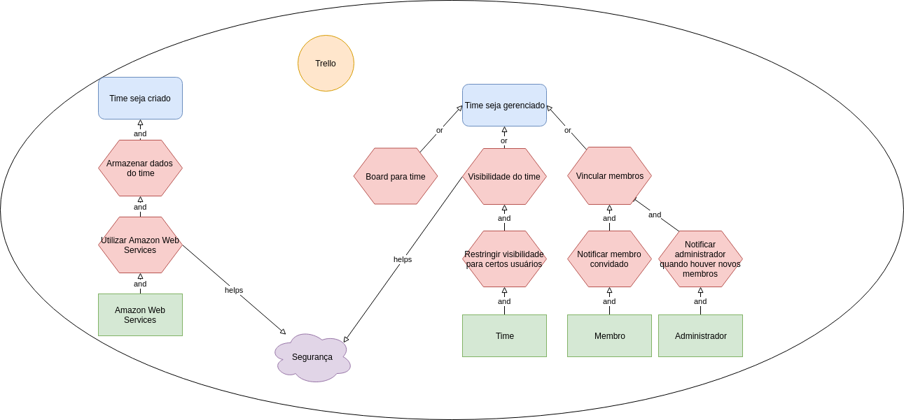

[Lista de Autores do artefato](/artefatos.html)

# iStar

## SD01 - Time

## SR - Time

## SD02 - Board

## SR - Board

## SD03 - Busca

## SR - Busca

## SD04 - Card

## SR - Card

## SD05 - Filtrar Card

## SR - Filtrar Card

### Versão 1

### Versão 2

