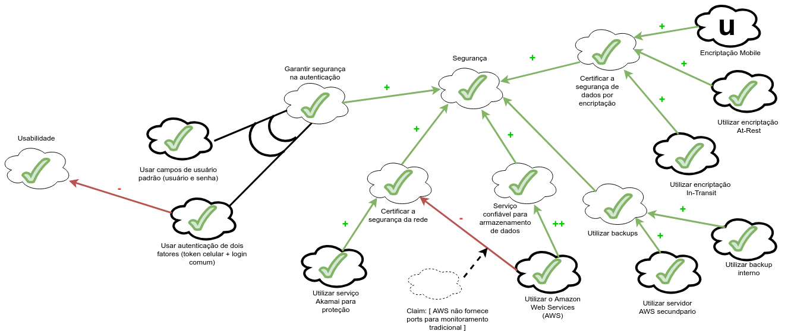

[Lista de Autores do artefato](/artefatos.html)

# NFR

Para uma melhor descrição de requisitos não funcionais, o time confeccionou artefatos baseados no padrão NFR.

Cobrimos, nesta página, algumas dimensões ditas referentes à requisitos não funcionais, que não são, portanto, cobertas em outros artefatos previamente confeccionados. Elas são:

- API
- Usabilidade web e mobile
- Acessibilidade
- Privacidade
- Segurança
- Suportabilidade
- Desempenho

## API

[Versão anterior](outdated_nfr.html#api)

## Acessibilidade

[Versão anterior](outdated_nfr.html#acessibilidade)

## Desempenho

## Privacidade

### Versão 1

### Versão 2

## Interface

## Usabilidade 

[Versão anterior](outdated_nfr.html#usabilidade)

## Usabilidade-Mobile

## Segurança

## Suportabilidade 

## Satisfação

