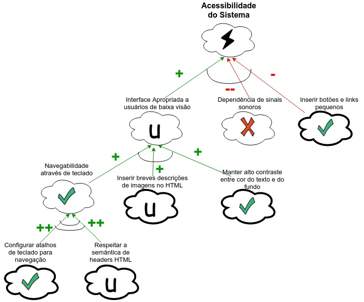
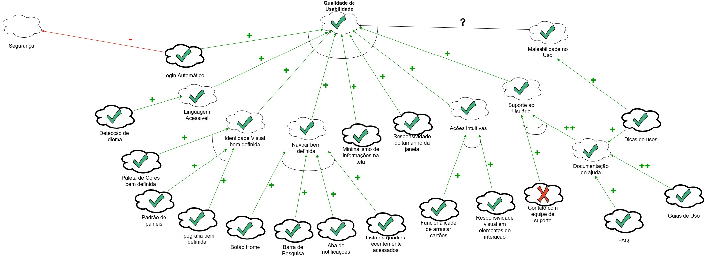

# Versões Desatualizadas de NFRs

Para que se mantenha rastro de alterações realizadas nos artefatos, são registradas aqui as versões antigas de NFRs confeccionadas. Vale lembrar que existem [versões atualizadas](nfr.html) e que as contidas aqui podem apresentar várias inconsistências em relação ao estado atual do projeto de requisitos, bem como erros no padrão de elaboração.

## API

## Acessibilidade

## Usabilidade

