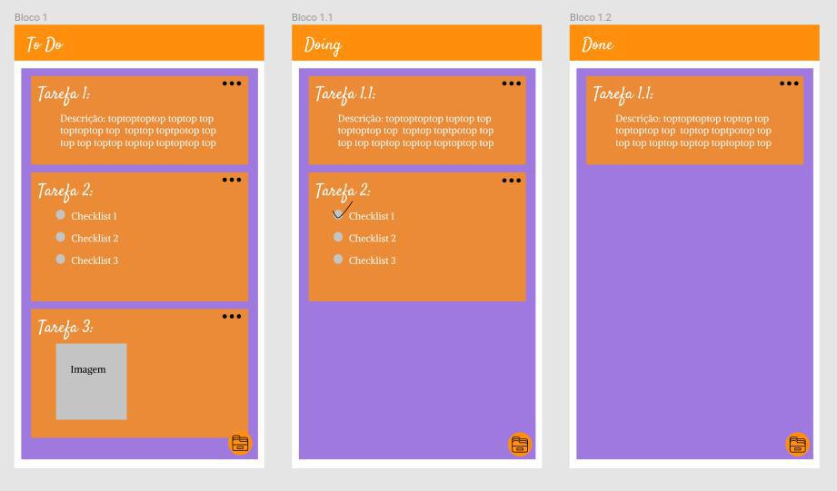

# Protótipo

Querendo aplicar a ideia da metodologia Kanban em uma aplicação digital, foi usado a ideia de cards dinâmicos para trazer a melhor usabilidade para o usuário.

Usando do material.io para desenvolver um melhor design para que usar a aplicação seja melhor possivel para o usuário.

### Requisitos

| Número | Requisito |
|  :-: |   :-:  |
| 01 | Criação de card. |
| 02 | Criação de board. |
| 03 | Upload de arquivo. |
| 04 | Arquivar card. |
| 05 | Criação de Checklist. |
| 06 | Mover card entre boards. |