[Lista de Autores do artefato](/artefatos.html)

# Introdução

Foi elaborado um questionário para estabelecer os possíveis requisitos para a plataforma Trello, já que existem diversas alternativas utilizadas no dia-a-dia para a organização, tanto virtuais quanto físicas(calendário, agenda, quadro Kanban, etc).

## Primeiros esboços

### Primeira Versão

[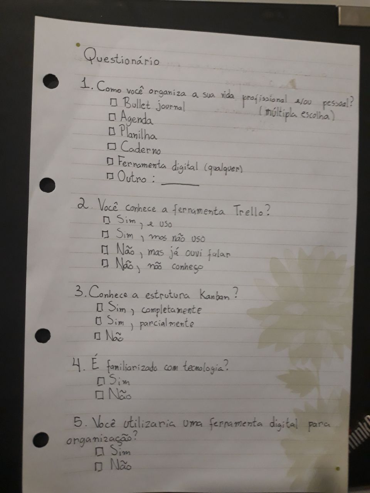](imagens/questionario/questionario.jpg width=200)

Esta é a primeira versão do questionário confeccionado pela equipe a fim de conhecer a base de usuários do Trello. Foi percebido que faltava um encaminhamento no questionário com base nas respostas e que as perguntas geravam pouco retorno no levantamento de requisitos.

## Questionário

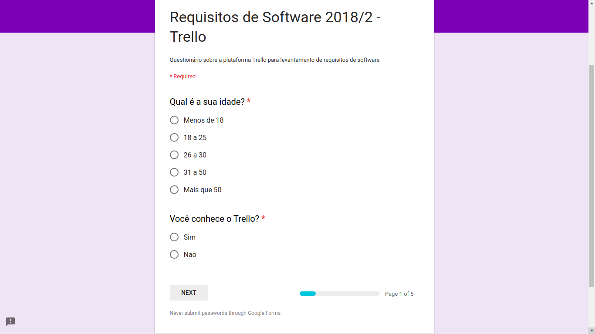
Na próxima tentativa, a equipe decidiu por fazer o questionário pelo Google Forms, pois a ferramenta possibilita uma forma de encaminhar o respondente conforme as suas respostas durante o questionário.

[Link](https://goo.gl/forms/1udfAdRRoOU8tlmo2)

### Resultados
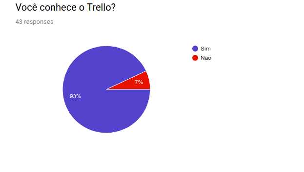
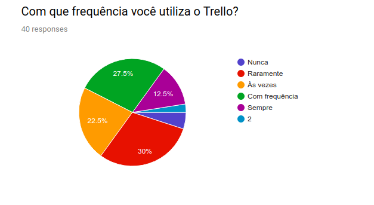
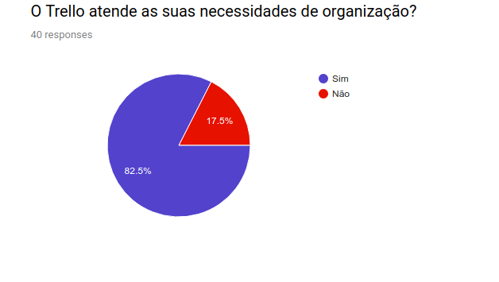
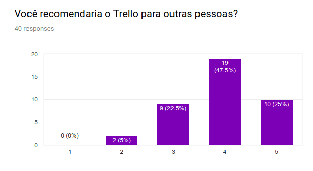

#### Perguntas à usuários não satisfeitos
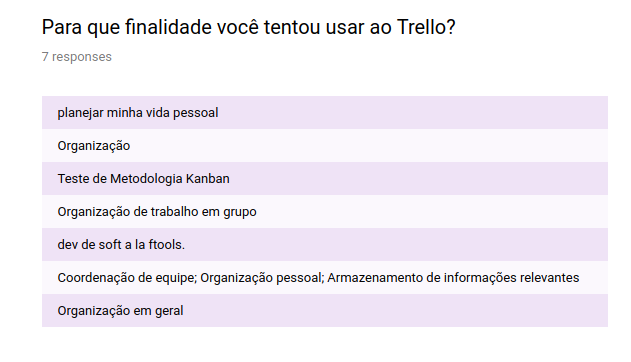
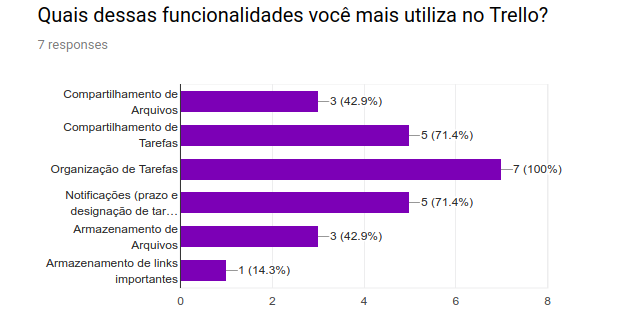
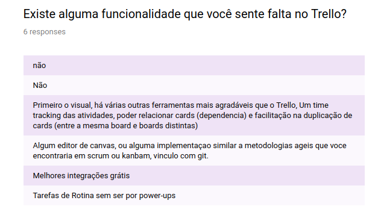
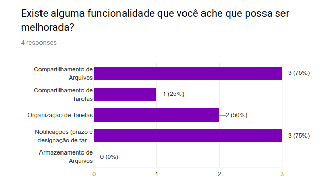

### Perguntas à usuários satisfeitos
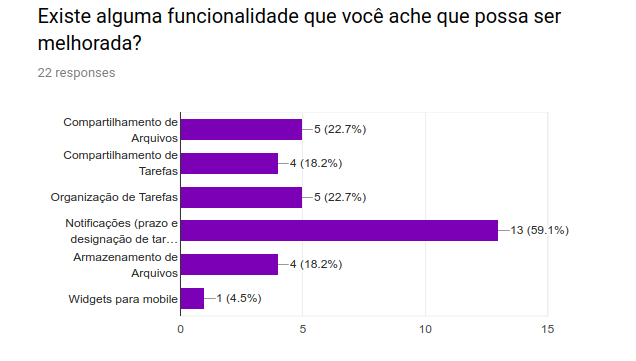

## Conclusões

Foi possível levantar os seguintes requisitos a partir do questionário:

| # | Requisito |
|  --: |   :-:  |
| 01 | Organização de tarefas. |
| 02 | Armazenamento de arquivos. |
| 03 | Melhoras de usabilidade. |
| 04 | Melhores notificações. |
| 05 | Convites e sincronização com outras plataformas |
| 06 | Roadmap |
| 07 | Relatórios |