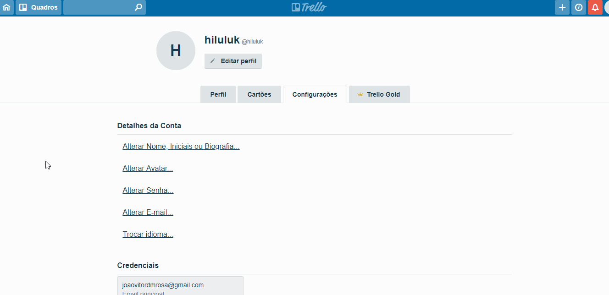

# Forward From

Para garantir que os requisitos estão sendo cumpridos e que ainda fazem sentido durante a execução da aplicação, eles serão aqui relacionados com as tasks de implementação de cada requisito e com as funcionalidades operando no sistema.

|  **ID** | **Nome** | **Documento Fonte** | **Responsável** | **Tasks** |
|  :------: | :------: | :------: | :------: | :------: |
|  [RQ01](#rq-01---compatibilidade-com-atalhos-de-teclado) | Compatibilidade com atalhos de teclado | [US1](tema aplicativo.md#us1---tornar-atalhos-de-teclado-compatíveis) | Samuel | [ ] - Criar possibilidade de utilizar atalhos do teclado |
|  [RQ02](#rq-02---crud-de-cartões) | CRUD de cards | [US2](tema card.md#us2---crud-do-card) | Samuel | [ ] - Possibilitar criação do Card [ ] - Possibilitar a edição do Título do Card [ ] -  Possibilitar a expansão do Card para editar as informações [ ] - Possibilitar o arquivamento do Card |
|  [RQ03](#rq-03---suporte-à-deadlines-nos-cartões) | Suporte à deadlines nos cards | [US3](tema card.md#us3---criar-deadlines-nos-cards) | Samuel | [ ] - Criar botão para criar uma Deadline [ ] - Criar botão para editar uma Deadline [ ] - Criar botão para deletar uma Deadline [ ] - Possibilitar a escolha da deadline digitando a data [ ] - Possibilitar a escolha da deadline no calendário |
|  [RQ04](#rq-04---criação-de-descrição-nos-cartões) | Criação de descrição nos cards | [US4](tema card.md#us4--criar-descrição-nos-cards) | Samuel | [ ] - Possibilitar a criação de uma descrição para o Card [ ] - Criar botão para editar a descrição do Card [ ] - Possibilitar Formatação Especial na descrição do Card [ ] - Exibir Ajuda para Formatação |
|  [RQ05](#rq-05---criação-de-checklists-nos-cartões) | criação de checklists nos cards | [US5](tema card.md#us5---criar-checklists-nos-cards) | Samuel | [ ] - Criar botão para criar Checklist [ ] - Criar botão para editar título Checklist [ ] - Criar botão para deletar Checklist [ ] - Possibilitar copiar itens de outra checklist [ ] - Criar botão para adicionar Item em Checklist [ ] - Criar atalho para marcar membros no item de checklist [ ] - Criar atalho pra emoji no item de checklist [ ] - Criar botão para excluir Item de Checklist [ ] - possibilitar a converção de um Item em cartão |
|  [RQ06](#rq-06---armazenamentos-de-anexos-nos-cartões) | Armazenamentos de anexos nos cards | [US6](tema card.md#us6---armazenar-anexos-nos-cards) | Samuel | [ ] - Adicionar opção de anexar arquivo a partir do Computador [ ] - Adicionar opção de anexar arquivo a partir do Trello [ ] - Adicionar opção de anexar arquivo a partir do Google Drive [ ] - Adicionar opção de anexar arquivo a partir do Dropbox [ ] - Adicionar opção de anexar arquivo a partir do Box [ ] - Adicionar opção de anexar arquivo a partir do OneDrive [ ] - Adicionar opção de anexar arquivo a partir de link [ ] - Possibilitar a adição de um anexo a um comentário  [ ] - Criar opção de remoção de um Anexo |
|  [RQ07](#rq-07---comentários-nos-cartões) | Comentários nos cards | [US7](tema card.md#us7---comentar-nos-cards) | Samuel | [ ] - Possibilitar adicionar Comentário [ ] - Criar atalho para adicionar anexo no comentário [ ] - Criar atalho para Adicionar Emoji ao comentário [ ] - Criar atalho para mencionar cartão no comentário [ ] - Criar atalho para mencionar Membros no comentário [ ] - Criar botão para editar comentário [ ] - Possibilitar excluir comentário [ ] - Possibilitar reagir com emoji ao comentário |
|  [RQ08](#rq-08---criação-de-cards-em-massa) | Criação de cards em massa | [US8](tema card.md#us8---criar-cards-em-massa) | Lucas | [ ] - Criar opção de criação de vários cards quando inserido uma lista de temas na criação de cards [ ] - Criar cards correspondentes aos temas inseridos |
|  [RQ09](#rq-09---Mencionar-usuários-em-comentários) | Mencionar usuários em comentários | [US9](tema card.md#us9---mencionar-usuários-em-comentários) | Lucas | [ ] - Criar opção de mencionar membros na caixa de comentário [ ] - Mostrar lista de membros do Board quando opção de mencionar for selecionada [ ] - Gerar, na caixa de comentário, referencia à membro(s) selecionado(s) |
|  [RQ10](#rq-10---delegar-cards-a-usuários) | Delegar cards a usuários | [US10](tema card.md#us10---delegar-cards-a-usuários) | Lucas | [ ] - Criar opção de 'membros' no menu lateral da página card [ ] - Mostrar lista de membros do Board quando opção 'membros' for selecionada [ ] - Associar membro à card [ ] - Mostrar lista de membros aos quais o card foi delegado no topo da página do card |
|  [RQ11](#rq-11---notificar-prazos-de-entrega-próximos-a-usuários-assinalados) | Notificar prazos de entrega próximos a usuários assinalados | [US11](tema card.md#us11---notificar-prazos-de-entrega-próximos-a-usuários-assinalados) | Lucas | [ ] - Criar notificação na aba de notificações da aplicação com informações do card que possui prazo de entrega próximo [ ] - Enviar email com nome do card, link e data de entrega |
|  [RQ12](#rq-12---marcar-data-de-entrega-como-concluída) | Marcar data de entrega como concluída | [US12](tema card.md#us12---marcar-data-de-entrega-como-concluída) | Lucas | [ ] - Criar checklist junto à indicação da data de entrega presente no card [ ] - Mudar cor da área onde se encontra a data de entrega para indicar a mudança de status da mesma |
|  [RQ13](#rq-13---compatibilidade-com-markdown-nas-descrições-dos-cards) | Compatibilidade com markdown nas descrições dos cards | [US13](tema card.md#us13---gerar-descrições-dos-cards-com-markdown) | Lucas | [ ] - Adicionar compilador de markdown à caixa de texto de descrição dos cards |
|  [RQ14](#rq-14---adição-de-etiquetas-aos-cards) | Adição de etiquetas aos cards | [US14](tema card.md#us14---adicionar-etiquetas-aos-cards) | Lucas | [ ] - Criar opção 'etiquetas' no menu lateral da página card [ ] - Mostrar lista de membros do Board quando opção 'etiquetas' for selecionada [ ] - Associar etiqueta(s) à card [ ] - Mostrar lista de etiquetas na página do card |
|  [RQ15](#rq-15---pesquisar-cards) | Pesquisar cards | [US15](tema card.md#us15---pesquisar-cards) | Max | [ ] - Desenvolver barra de busca [ ] - A busca deve mostrar todas os cards com o nome relacionado [ ] - Deverá haver acesso ao card pela pesquisa |
|  [RQ16](#rq-16---anexar-cards-a-outros-cards) | Anexar cards a outros cards | [US16](tema card.md#us16---anexar-cards-a-outros-cards) | Max | [ ] - Botão para anexar card, boards, links, arquivos e power-ups em um card [ ] - Deve exibir uma barra de busca / um espaço para colar o link que deseja ser anexado [ ] - Escrever o nome do card faz com que ele apareça, facilitando a questão de anexar [ ] - Após o anexo deve ser exibido no card o que foi anexado (card), e quem anexou |
|  [RQ17](#rq-17---anexar-boards-a-cards) | Anexar boards a cards | [US17](tema card.md#us17---anexar-boards-a-cards ) | Max | [ ] - Botão para anexar card, boards, links, arquivos e power-ups em um card [ ] - Deve exibir uma barra de busca / um espaço para colar o link que deseja ser anexado [ ] - Escrever o nome do card faz com que ele apareça, facilitando a questão de anexar [ ] - Após o anexo deve ser exibido no card o que foi anexado (board), e quem anexou |
|  [RQ18](#rq-18---seguir-um-card) | Seguir um card | [US18](tema card.md#us18---seguir-um-card) | Max | [ ] - Criar um botão dentro de card  [ ] - Deve ser discreto  [ ] - Deve fornecer feedback visual sobre estar seguindo [ ] - Permite ao usuário receber notificações sobre o card que está sendo seguido |
|  [RQ19](#rq-19---criar-card-através-de-e-mails) | Criar card através de e-mails | [US19](tema card.md#us19---criar-card-através-de-e-mails) | Max | [ ] - Fornecer um link para o usuário [ ] - Link viincula o quadro como um email para o board [ ] - O card pode ser criado através desse link [ ] - O link funciona como um email do quadro |
|  [RQ20](rq-20---login) | Login | [US20](tema conta.md#us20---logar) | Max | [ ] - Mostrar na tela inicial o botão do login com email e senha [ ] - Move o usuário para dentro da aplicação após a inserção do email e da senha |
|  [RQ21](rq-21---login-com-o-google) | Login com o Google | [US21](tema conta.md#us21---logar-com-o-google) | Max | [ ] - Mostrar o botão com nome e logo do Google na tela inicial da aplicação [ ] - Botão disponibiliza possíveis contas para login [ ] - Ao clicar, e se usuário tiver conta, ele tem acesso a aplicação |
|  [RQ22]() | Cadastrar | [US22](tema conta.md#us22---cadastrar-usuário) | João | [ ] - Criar opção 'Cadastre-se' na pagina inicial [ ] - Criar campos para o usuário inserir suas informações de cadastro [ ] - Criar opção ''Criar nova conta' para efetivar o cadastro |
|  [RQ23]() | Cadastrar com o Google | [US23](tema conta.md#us23---cadastrar-usuário-com-o-google) | João | [ ] - Criar opção 'Cadastre-se' na pagina inicial  [ ] - Criar opção 'Cadastre-se com Google' na pagina de cadastro [ ] - Mostrar contas do Google ja cadastradas e a opção 'outra conta' para entrar com uma ainda não cadastrada no navegador |
|  [RQ24]() | Alterar senha | [US24](tema conta.md#us24---alterar-senha) | João | [ ] - Criar opção 'Alterar Senha...' na pagina de configurações do usuario  [ ] - Criar campo para o usuário inserir sua senha antiga para validação da alteração e campos para inserir a nova senha [ ] - Criar opção 'Salvar' para efetivar a alteração |
|  [RQ25]() | CRUD de listas | [US25](tema lista.md#us25---crud-de-listas) | João | [ ] - Criar opção 'Adicionar outra lista' na pagina inicial do board [ ] - Criar campo para o usuário inserir o título da lista [ ] - Criar opção ''Criar lista' para efetivar a criação da lista |
|  [RQ26]() | Seguir uma lista | [US26](tema lista.md#us26---seguir-uma-lista) | João | [ ] - Criar opção 'Seguir' no menu 'Ações da lista' |
|  [RQ27]() | CRUD de Boards | [US27](tema quadro.md#us27---crud-de-boards) | João | [ ] - Criar opção 'Criar um board' na pagina inicial do Trello [ ] - Criar campos para o usuário inserir o título, icone, time e a privacidade do board [ ] - Criar opção ''Criar quadro' para efetivar a criação da lista |
|  [RQ28]() | Convite para membros do Board | [US28](tema quadro.md#us28---criar-convite-para-membros-do-board) | João | [ ] - Criar opção para convidar membros para o board  [ ] - Criar campo para o usuario inserir o email ou nome do membro a ser convidado  [ ] - Criar opção 'enviar convite' para efetivar o convite do membro [ ] - Criar opção 'Criar link' para gerar um link com o convite para o board [ ] - Criar opção 'Copiar' para copiar o link do convite |
|  [RQ29](#rq-29---gestão-de-visibilidade-do-board) | Gestão de visibilidade do Board | [US29](tema quadro.md#us29---gerir-visibilidade-do-board) | Rossicler | [ ] - Criar opção onde o administrador de um board pode gerenciar quem pode ver determinado Board [ ] - Criar lógica onde o sistema pode distinguir diferentes tipos de usuários dentro de um Board |
|  [RQ30](#rq-30---adição-de-times-aos-boards) | Adição de times aos Boards | [US30](tema quadro.md#us30---adicionar-times-a-boards) | Rossicler | [ ] - Adicionar opção de "Alterar time" nas configurações de um Board [ ] - Dar opções de times a adicionar, mostrando apenas os times em que o usuário está participando [ ] - Adicionar todos os membros do time selecionado naquele Board |
|  [RQ31](#rq-31---adicionar-membro-a-board) | Adicionar membro a Board | [US31](tema quadro.md#us31---adicionar-membro-a-board) | Rossicler | [ ] - Adicionar ícone que demonstre a ação de adicionar um membro ao Board [ ] - Mostrar um Input onde pode ser digitado o nome ou o email do usuário a ser adicionado [ ] - Criar a opção da criação de um link onde usuários podem entrar no Board a partir dele [ ] - Criar Input onde será a descrição do convite que o convidade receberá |
|  [RQ32](#rq-32---alterar-plano-de-fundo) | Alterar plano de fundo | [US32](tema quadro.md#us32---alterar-plano-de-fundo) | Rossicler | [ ] - Criar opção de alterar tela de fundo no menu do Board [ ] - Criar opção de cores para o plano de fundo [ ] - Criar opção de fotos (planos de fundos padrões) [ ] - Criar opção de planos de fundos personalizados para membros do Business Class |
|  [RQ33](#rq-33---oferecer-biblioteca-de-imagens-para-plano-de-fundo) | Oferecer biblioteca de imagens para plano de fundo | [US33](tema quadro.md#us33--oferecer-biblioteca-de-imagens-para-plano-de-fundo) | Rossicler | [ ] - Selecionar imagens para servirem como plano de fundo padrões dos Boards [ ] - Adicionar as imagens dentro da opção de fotos de plano de fundo |
|  [RQ34](#rq-34---interações-com-ferramentas-externas) | Interações com ferramentas externas | [US34](tema quadro.md#us34---integrar-um-board-com-ferramentas-externas) | Rossicler | [ ] - Criar opções de Power-Ups no menu do Board [ ] - Mostrar todos os Power-Ups disponíveis [ ] - Criar um input para pesquisar dentro dos Power-Ups [ ] - Criar categorias de Power-Ups |
|  [RQ35](#rq-35---copiar-board) | Copiar Board | [US35](tema quadro.md#us35---copiar-um-board) | Rossicler | [ ] - Criar opção de Copiar Board dentro do menu do Board [ ] - Dar a opção de escolher um nome para o novo Board [ ] - Dar a opção de escolher um time para ser adicionado esse novo Board [ ] - Criar a opção de alterar a visibilidade do Board(privado, público, etc) [ ] - Checklist de manter os cards do Board copiado |
|  [RQ36]() | Seguir um Board | [US36](tema quadro.md#us36---seguir-um-board) | Érico | [ ]- Criar uma área na barra lateral esquerda com a opção de seguir [ ]- Criar lógica para que sempre que o cursor estiver no botão ele mudar de cor [ ]- Criar lógica para que ao clicar no botão desejado ele coloque uma imagem referente que faça entender que o usuário esteja seguindo. |
|  [RQ37]() | Favoritar Boards | [US37](tema quadro.md#us37---favoritar-boards) | Érico | [ ]- Criar uma imagem ao lado do nome de cada Board listado com formato de estrela [ ]- Criar lógica para quando clicar na estrela ela mude de cor, indicando que o Board foi favoritado |
|  [RQ38]() | CRUD de times | [US38](tema time.md#us38---crud-de-times) | Érico | [ ]- Criar um botão de "Criar Time" [ ]- Criar espaço para botar nome do time e descrição (opcional) [ ]- Criar lógica para que quando o nome do time seja escrito um botão possa ser clicado para criar o time  |
|  [RQ39]() | Visualizar membros de um time | [US39](tema time.md#us39-visualizar-membros-de-um-time) | Érico | [ ]- Criar área na parte superior mostrando algumas fotos de membros do time [ ]- Criar botão perto das fotos dos membros com o número de membros que mostre todos |
|  [RQ40]() | Editar visibilidade do time | [US40](tema time.md#us40-editar-visibilidade-do-time) | Érico | [ ]- Criar uma área para editar o Time [ ]- Criar área para editar configurações [ ]- Criar botão para editar visualização do time [ ]- Criar opções para visualização e resposta a elas |
|  [RQ41]() | Gerenciar administradores do time | [US41](tema time.md#us41---gerenciar-administradores-do-time) | Érico | [ ]- Criar área para membros do time [ ]- Criar dropdown que tenha as opções de tipo de usuário |
|  [RQ42]() | Detalhar time | [US42](tema time.md#us42---detalhar-time) | Érico | [ ]- Criar botão na área do time para editar [ ]- Criar área para escrever detalhes do time |
|  [RQ43]() | Gerenciar membros de um time | [US43](tema time.md#us43---gerenciar-membros-de-um-time) | Érico | [ ]- Criar Área para membros do time [ ]- Criar botões para gerenciar área os membros do time (remover, adicionar, etc.) |
|  [RQ44](#rq-44---descrição-das-imagens-no-html) | Descrição de imagens no HTML | US44 | Filipe | O Trello não contém imagens siginificativas. Cabe ao usuário adicionar imagens cujo título faça sentido |
|  [RQ45](#rq-45---modo-daltônico) | Modo daltônico | [US45]() | Filipe | [ ] - Criar opção de ativação/desativação do modo daltônico em Opções do Usuário [ ] - Criação de padrões visuais através das quais seja possível identificar labels sem a necessidade de distinção de cor |
|  [RQ46](#rq-46---alto-contraste-entre-texto-e-fundo) | Alto contraste entre texto e fundo | [US46]() | Filipe | Validar todas as cores entre texto e fundo [ ] - Todo texto em negrito ou de tamanho acima de 24 deve ter taxa de contraste entre o fundo de 4.5:1 ou maior [ ] - Todos os demais textos devem ter contraste 7.0:1 ou maior |
|  [RQ47](#rq-47---elaboração-da-política-de-privacidade) | Elaboração da Política de Privacidade | [US47]() | Filipe | Explicar [ ] - Quais informações são coletadas do usuário [ ] - O acontece com as informações coletadas [ ] - Quem tem acesso às informações coletadas [ ] - Como são armazenadas as informações coletadas [ ] - Como acessar e controlar as informações coletadas [ ] - Como as informações coletadas são transferidas internacionalmente [ ] - Outras informações importantes acerca de privacidade |
|  [RQ48](#rq-48---manter-sessão) | Manter sessão | [US48]() | Filipe | [ ] - Salvar a sessão localmente |
|  [RQ49](#rq-49---responsividade-de-acordo-com-tamanho-de-tela) | Responsividade de acordo com tamanho de tela | [US49]() | Filipe | [ ] - Utilização de features CSS para que os elementos possam flutuar na tela |
|  [RQ50](#rq-50---detecção-de-idioma) | Detecção de Idioma | [US50]() | Filipe | [ ] - Detectar idioma do sistema do usuário [ ] - Definir idioma através da geolocalização por IP (entre os idiomas disponíveis) |
|  [RQ51](#rq-51---botão-home) | Botão Home | [US51]() | Filipe | [ ] - Inserir botão no header que leve à página inicial [ ] - O botão não deve ter cor, apenas clarear o fundo |
|  [RQ52](#rq-52---pesquisar-qualquer-coisa) | Pesquisa de Qualquer Coisa | [US52]() | Eduardo | [ ] - Criar campo para busca [ ] - Pesquisar termo digitado em todas as boards que o usuário tem acesso [ ] - Mostrar resultado na barra de pesquisa |
|  [RQ53](#rq-53---aba-de-notificações) | Aba de notificações | [US53]() | Eduardo | [ ] - Criar ícone para notificações [ ] - Alterar aparência do ícone caso hajam uma ou mais notificações [ ] - Redirecionar o usuário à origem da notificação |
|  [RQ54](#rq-54---documentação-de-ajuda) | Documentação de Ajuda | [US54]() | Eduardo | [ ] - Criar link para ajuda [ ] - Oferecer tópicos pertinentes a dificuldades que o usuário pode encontrar |
|  RQ55 | Certificação Akamai | [US55]() | Eduardo |  |
|  RQ56 | Servidores Secundários AWS | [US56]() | Eduardo |  |
|  RQ57 | Encriptação in-Transit | [US57]() | Eduardo |  |
|  RQ59 | Encriptação at-Rest | [US59]() | Eduardo |  |
|

## RQ 01 - Compatibilidade com atalhos de teclado
- [ ] Criar possibilidade de utilizar atalhos do teclado

## RQ 02 - CRUD de cartões

- [ ] Possibilitar criação do Card
- [ ] Possibilitar a edição do Título do Card
- [ ] Possibilitar a expansão do Card para editar as informações
- [ ] Possibilitar o arquivamento do Card

Task-1 

Task-2 

Task-3

Task-4

## RQ 03 - Suporte à deadlines nos cartões
- [ ] Criar botão para criar uma Deadline
- [ ] Criar botão para editar uma Deadline
- [ ] Criar botão para deletar uma Deadline
- [ ] Possibilitar a escolha da deadline digitando a data
- [ ] Possibilitar a escolha da deadline no calendário

Task-1 

Task-2 

Task-3 

Task-4 

Task-5 

## RQ 04 - Criação de descrição nos cartões
- [ ] Possibilitar a criação de uma descrição para o Card
- [ ] Criar botão para editar a descrição do Card
- [ ] Possibilitar Formatação Especial na descrição do Card
- [ ] Exibir Ajuda para Formatação

Task-1 

Task-2 

Task-3 

Task-4 

## RQ 05 - Criação de checklists nos cartões
- [ ] Criar botão para criar Checklist
- [ ] Criar botão para editar título Checklist
- [ ] Criar botão para deletar Checklist
- [ ] Possibilitar copiar itens de outra checklist
- [ ] Criar botão para adicionar Item em Checklist
- [ ] Criar atalho para marcar membros no item de checklist
- [ ] Criar atalho pra emoji no item de checklist
- [ ] Criar botão para excluir Item de Checklist
- [ ] Possibilitar a converção de um Item em cartão

Task-1 

Task-2 

Task-3 

Task-4 

Task-5 

Task-6 

Task-7 

Task-8 

Task-9 

## RQ 06 - Armazenamentos de anexos nos cartões
- [ ] Adicionar opção de anexar arquivo a partir do Computador
- [ ] Adicionar opção de anexar arquivo a partir do Trello
- [ ] Adicionar opção de anexar arquivo a partir do Google Drive
- [ ] Adicionar opção de anexar arquivo a partir do Dropbox
- [ ] Adicionar opção de anexar arquivo a partir do Box
- [ ] Adicionar opção de anexar arquivo a partir do OneDrive
- [ ] Adicionar opção de anexar arquivo a partir de link
- [ ] Possibilitar a adição de um anexo a um comentário 
- [ ] Criar opção de remoção de um Anexo

Task-1 

Task-2 

Task-3 

Task-4 

Task-5 

Task-6 

Task-7 

Task-8 

Task-9 

## RQ 07 - Comentários nos cartões
- [ ] Possibilitar adicionar Comentário
- [ ] Criar atalho para adicionar anexo no comentário
- [ ] Criar atalho para Adicionar Emoji ao comentário
- [ ] Criar atalho para mencionar cartão no comentário
- [ ] Criar atalho para mencionar Membros no comentário
- [ ] Criar botão para editar comentário
- [ ] Possibilitar excluir comentário
- [ ] Possibilitar reagir com emoji ao comentário

Task-1 

Task-2 

Task-3 

Task-4 

Task-5 

Task-6 

Task-7 

Task-8 

## RQ 08 - Criação de cards em massa

 - [ ] Criar opção de criação de vários cards quando inserido uma lista de temas na criação de cards
 - [ ] Criar cards correspondentes aos temas inseridos

 

## RQ 09 - Mencionar usuários em comentários

 - [ ] Criar opção de mencionar membros na caixa de comentário
 - [ ] Mostrar lista de membros do Board quando opção de mencionar for selecionada
 - [ ] Gerar, na caixa de comentário, referencia à membro(s) selecionado(s)

## RQ 10 - Delegar cards a usuários

 - [ ] Criar opção de 'membros' no menu lateral da página card
 - [ ] Mostrar lista de membros do Board quando opção 'membros' for selecionada
 - [ ] Associar membro à card
 - [ ] Mostrar lista de membros aos quais o card foi delegado no topo da página do card

## RQ 11 - Notificar prazos de entrega próximos a usuários assinalados

 - [ ] Criar notificação na aba de notificações da aplicação com informações do card que possui prazo de entrega próximo
 - [ ] Enviar email com nome do card, link e data de entrega

## RQ 12 - Marcar data de entrega como concluída

 - [ ] Criar checklist junto à indicação da data de entrega presente no card
 - [ ] Mudar cor da área onde se encontra a data de entrega para indicar a mudança de status da mesma

## RQ 13 - Compatibilidade com markdown nas descrições dos cards

- [ ] Adicionar compilador de markdown à caixa de texto de descrição dos cards

## RQ 14 - Adição de etiquetas aos cards

- [ ] Criar opção 'etiquetas' no menu lateral da página card
- [ ] Mostrar lista de membros do Board quando opção 'etiquetas' for selecionada
- [ ] Associar etiqueta(s) à card
- [ ] Mostrar lista de etiquetas na página do card

## RQ 15 - Pesquisar cards

- [ ] Desenvolver barra de busca
- [ ] A busca deve mostrar todas os cards com o nome relacionado
- [ ] Deverá haver acesso ao card pela pesquisa

## RQ 16 - Anexar cards a outros cards

- [ ] Botão para anexar card, boards, links, arquivos e power-ups em um card
- [ ] Deve exibir uma barra de busca / um espaço para colar o link que deseja ser anexado
- [ ] Escrever o nome do card faz com que ele apareça, facilitando a questão de anexar
- [ ] Após o anexo deve ser exibido no card o que foi anexado (card), e quem anexou

## RQ 17 - Anexar boards a cards

- [ ] Botão para anexar card, boards, links, arquivos e power-ups em um card
- [ ] Deve exibir uma barra de busca / um espaço para colar o link que deseja ser anexado
- [ ] Escrever o nome do card faz com que ele apareça, facilitando a questão de anexar
- [ ] Após o anexo deve ser exibido no card o que foi anexado (board), e quem anexou

## RQ 18 - Seguir um Card

- [ ] Criar um botão dentro de card 
- [ ] Deve ser discreto 
- [ ] Deve fornecer feedback visual sobre estar seguindo
- [ ] Permite ao usuário receber notificações sobre o card que está sendo seguido

## RQ 19 - Criar card através de e-mails

- [ ] Fornecer um link para o usuário
- [ ] Link viincula o quadro como um email para o board
- [ ] O card pode ser criado através desse link
- [ ] O link funciona como um email do quadro

## RQ 20 - Login

- [ ] Mostrar na tela inicial o botão do login com email e senha
- [ ] Move o usuário para dentro da aplicação após a inserção do email e da senha

## RQ 21 - Login com o Google

- [ ] Mostrar o botão com nome e logo do Google na tela inicial da aplicação
- [ ] Botão disponibiliza possíveis contas para login
- [ ] Ao clicar, e se usuário tiver conta, ele tem acesso a aplicação

## RQ 22 - Cadastrar

- [ ] Criar opção 'Cadastre-se' na pagina inicial
- [ ] Criar campos para o usuário inserir suas informações de cadastro
- [ ] Criar opção ''Criar nova conta' para efetivar o cadastro

## RQ 23 - Cadastrar com o google

- [ ] Criar opção 'Cadastre-se' na pagina inicial
- [ ] Criar opção 'Cadastre-se com Google' na pagina de cadastro
- [ ] Mostrar contas do Google ja cadastradas e a opção 'outra conta' para entrar com uma ainda não cadastrada no navegador

## RQ 24 - Alterar senha

- [ ] Criar opção 'Alterar Senha...' na pagina de configurações do usuario
- [ ] Criar campo para o usuário inserir sua senha antiga para validação da alteração e campos para inserir a nova senha
- [ ] Criar opção 'Salvar' para efetivar a alteração

## RQ 25 - CRUD de listas

- [ ] Criar opção 'Adicionar outra lista' na pagina inicial do board
- [ ] Criar campo para o usuário inserir o título da lista
- [ ] Criar opção ''Criar lista' para efetivar a criação da lista

## RQ 26 - Seguir lista

- [ ] Criar opção 'Seguir' no menu 'Ações da lista'

## RQ 27 - CRUD de Board

- [ ] Criar opção 'Criar um board' na pagina inicial do Trello
- [ ] Criar campos para o usuário inserir o título, icone, time e a privacidade do board
- [ ] Criar opção ''Criar quadro' para efetivar a criação da lista

## RQ 28 - Convite para membros do board

- [ ] Criar opção para convidar membros para o board
- [ ] Criar campo para o usuario inserir o email ou nome do membro a ser convidado
- [ ] Criar opção 'enviar convite' para efetivar o convite do membro
- [ ] Criar opção 'Criar link' para gerar um link com o convite para o board
- [ ] Criar opção 'Copiar' para copiar o link do convite

## RQ 29 - Gestão de visibilidade do Board

- [ ] Criar opção onde o administrador de um board pode gerenciar quem pode ver determinado Board
- [ ] Criar lógica onde o sistema pode distinguir diferentes tipos de usuários dentro de um Board

## RQ 30 - Adição de times aos Boards

- [ ] Adicionar opção de "Alterar time" nas configurações de um Board
- [ ] Dar opções de times a adicionar, mostrando apenas os times em que o usuário está participando
- [ ] Adicionar todos os membros do time selecionado naquele Board

## RQ 31 - Adicionar membro a Board

- [ ] Adicionar ícone que demonstre a ação de adicionar um membro ao Board
- [ ] Mostrar um Input onde pode ser digitado o nome ou o email do usuário a ser adicionado
- [ ] Criar a opção da criação de um link onde usuários podem entrar no Board a partir dele
- [ ] Criar Input onde será a descrição do convite que o convidade receberá

## RQ 32 - Alterar plano de fundo

- [ ] Criar opção de alterar tela de fundo no menu do Board
- [ ] Criar opção de cores para o plano de fundo
- [ ] Criar opção de fotos (planos de fundos padrões)
- [ ] Criar opção de planos de fundos personalizados para membros do Business Class

## RQ 33 - Oferecer biblioteca de imagens para plano de fundo

- [ ] Selecionar imagens para servirem como plano de fundo padrões dos Boards
- [ ] Adicionar as imagens dentro da opção de fotos de plano de fund

## RQ 34 - Interações com ferramentas externas

- [ ] Criar opções de Power-Ups no menu do Board
- [ ] Mostrar todos os Power-Ups disponíveis
- [ ] Criar um input para pesquisar dentro dos Power-Ups
- [ ] Criar categorias de Power-Ups

## RQ 35 - Copiar Board

- [ ] Criar opção de Copiar Board dentro do menu do Board
- [ ] Dar a opção de escolher um nome para o novo Board
- [ ] Dar a opção de escolher um time para ser adicionado esse novo Board
- [ ] Criar a opção de alterar a visibilidade do Board(privado, público, etc)
- [ ] Checklist de manter os cards do Board copiado

## RQ 36 - Seguir um Board

- [ ] Criar uma área na barra lateral direito com a opção de seguir
- [ ] Criar lógica para que sempre que o cursor estiver no botão ele mudar de cor
- [ ] Criar lógica para que ao clicar no botão desejado ele coloque uma imagem referente que faça entender que o usuário esteja seguindo.

## RQ 37 - Favoritar Board

- [ ] Criar uma imagem ao lado do nome de cada Board listado com formato de estrela
- [ ] Criar lógica para quando clicar na estrela ela mude de cor, indicando que o Board foi favoritado

## RQ 38 - CRUD de Times 

- [ ] Criar um botão de "Criar Time"
- [ ] Criar espaço para botar nome do time e descrição (opcional)
- [ ] Criar lógica para que quando o nome do time seja escrito um botão possa ser clicado para criar o time 

## RQ 39 - Visualizar Membros de um Time

- [ ] Criar área na parte superior mostrando algumas fotos de membros do time
- [ ] Criar botão perto das fotos dos membros com o número de membros que mostre todos

## RQ 40 - Editar Visibilidade do Time

- [ ] Criar uma área para editar o Time
- [ ] Criar área para editar configurações
- [ ] Criar botão para editar visualização do time
- [ ] Criar opções para visualização e resposta a elas

## RQ 41 - Gerenciar Administradores do Time

- [ ] Criar área para membros do time
- [ ] Criar dropdown que tenha as opções de tipo de usuário

## RQ 42 - Detalhar Time

- [ ] Criar botão na área do time para editar
- [ ] Criar área para escrever detalhes do time

## RQ 43 - Gerenciar Membros de um Time

- [ ] Criar Área para membros do time
- [ ] Criar botões para gerenciar área os membros do time (remover, adicionar, etc.)

## RQ 44 - Descrição das Imagens no HTML

O Trello não contém imagens siginificativas. As imagens que podem ser 

## RQ 45 - Modo daltônico

- [ ] Criar opção de ativação/desativação do modo daltônico em Opções do Usuário
- [ ] Criação de padrões visuais através das quais seja possível identificar labels sem a necessidade de distinção de cor

## RQ 46 - Alto contraste entre texto e fundo

Validar todas as cores entre texto e fundo
- [ ] Todo texto em negrito ou de tamanho acima de 24 deve ter taxa de contraste entre o fundo de 4.5:1 ou maior
- [ ] Todos os demais textos devem ter contraste 7.0:1 ou maior

Algumas cores do site não cumprem o requisito, como a label amarela (imagem acima das labels) com texto branco.

## RQ 47 - Elaboração da Política de Privacidade

Explicar
- [ ] Quais informações são coletadas do usuário
- [ ] O acontece com as informações coletadas
- [ ] Quem tem acesso às informações coletadas
- [ ] Como são armazenadas as informações coletadas
- [ ] Como acessar e controlar as informações coletadas
- [ ] Como as informações coletadas são transferidas internacionalmente
- [ ] Outras informações importantes acerca de privacidade

O termo completo pode ser encontrado [aqui](https://trello.com/privacy)

## RQ 48 - Manter sessão

- [ ] Salvar a sessão localmente

Como pode-se observar pela animação, sair da página não desloga o usuário. Esse foi um exemplo de curta duração, mas enquanto o navegador manter os dados do usuários.

## RQ 49 - Responsividade de acordo com tamanho de tela

- [ ] Utilização de features CSS para que os elementos possam flutuar na tela

## RQ 50 - Detecção de Idioma

- [ ] Detectar idioma do sistema do usuário
- [ ] Definir idioma através da geolocalização por IP (entre os idiomas disponíveis)

Como a detecção de idioma depende do usuário do sistema, não foi possível capturar em imagem a troca do idioma acontecendo.

## RQ 51 - Botão Home

- [ ] Inserir botão no header que leve à página inicial
- [ ] O botão não deve ter cor, apenas clarear o fundo

## RQ 52 - Pesquisar Qualquer Coisa

- [ ] Criar campo para busca
- [ ] Pesquisar termo digitado em todas as boards que o usuário tem acesso
- [ ] Mostrar resultado na barra de pesquisa

## RQ 53 - Aba de Notificações

- [ ]Criar ícone para notificações
- [ ] Alterar aparência do ícone caso hajam uma ou mais notificações
- [ ] Redirecionar o usuário à origem da notificação

## RQ 54 - Documentação de Ajuda

- [ ] Criar link para ajuda
- [ ] Oferecer tópicos pertinentes a dificuldades que o usuário pode encontrar

