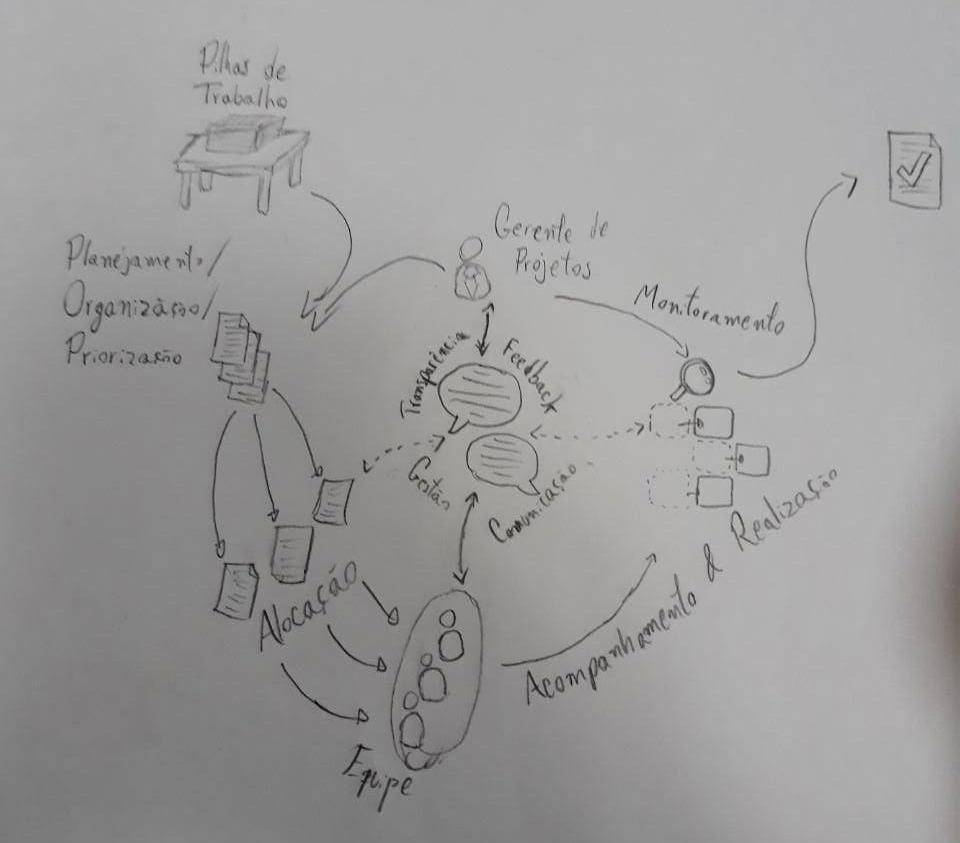

# Rich Pictures

Um Rich Picture é um artefato construído preferencialmente em colaboração com stakeholders a fim de ilustrar e, assim, trazer uma melhor compreensão do problema a ser resolvido pela equipe de desenvolvimento.

Não há formalidades sobre a confecção de um Rich Picture, mas é boa prática que ele tenha o escopo definido por um foco e um fluxo compreensível pelos envolvidos nos projetos, desenvolvedores ou não.

## Primeiros esboços

### Primeira Versão

Esta é a primeira versão de Rich Picture confeccionada pela equipe a fim de averiguar o problema que o Trello se propõe a resolver.

O time percebeu os pontos de confusão e a falta de foco do desenho.

### Visão Geral

Na próxima tentativa, a equipe definiu melhor a problemática. Note que a imagem tem um foco nítido, mas ainda não tão bem descrito, ilustrado pelos balões de conversação ao centro.

Obs: Houve preferência pela confecção manual do Rich Picture, sem a necessidade de ferramentas digitais a priori para uma melhor praticidade e agilidade na execução da ideia. Isso possibilitou uma melhor eficiência da equipe e maior engajamento e fluidez durante reuniões.