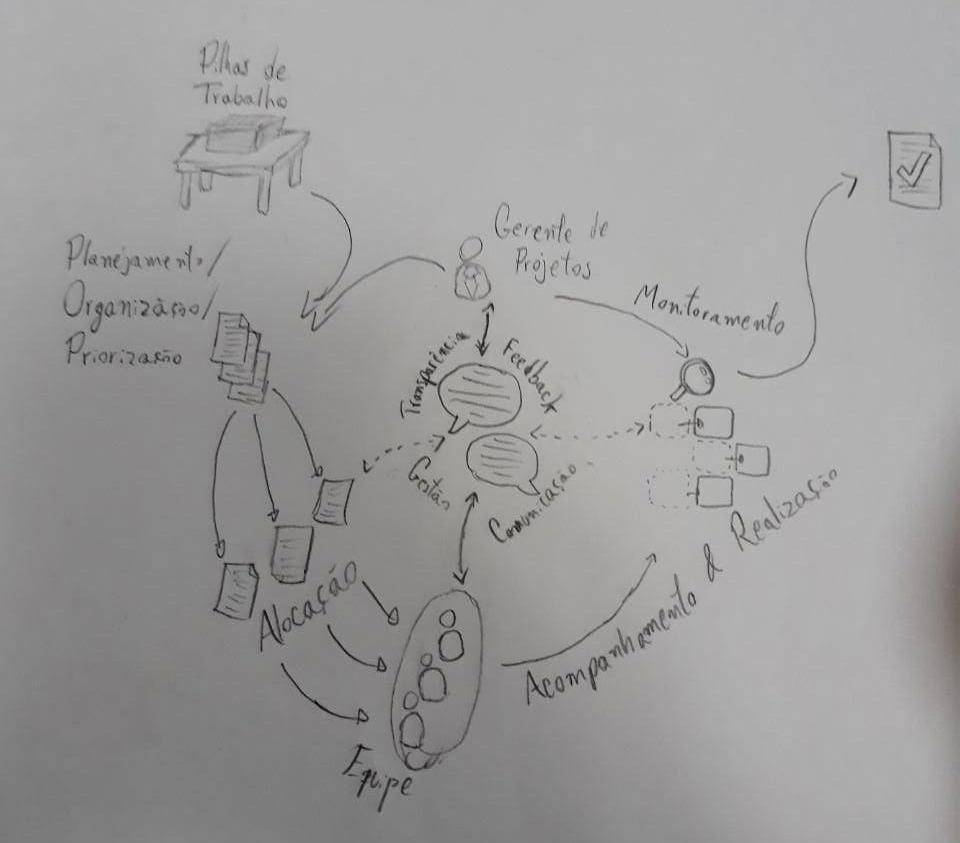
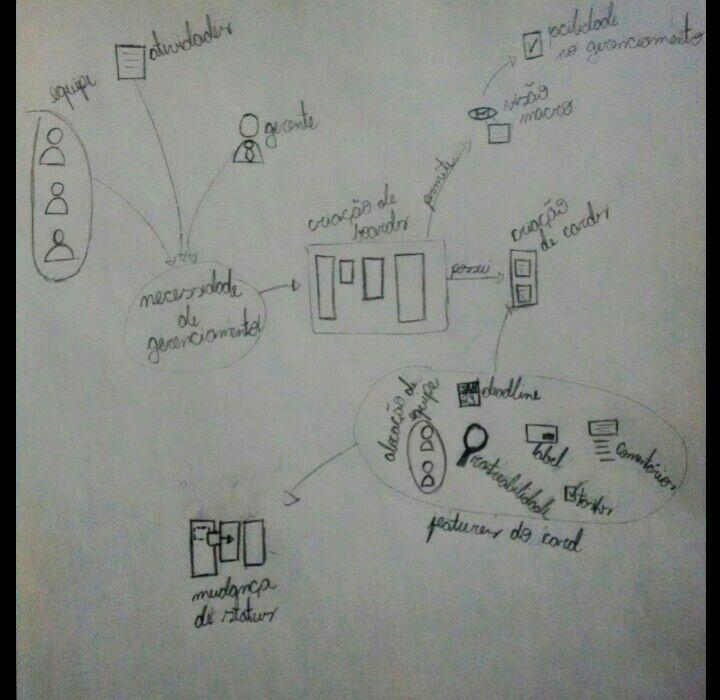
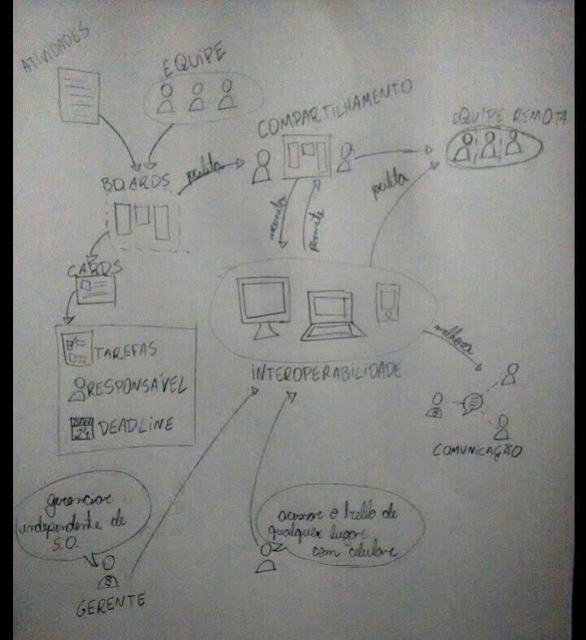
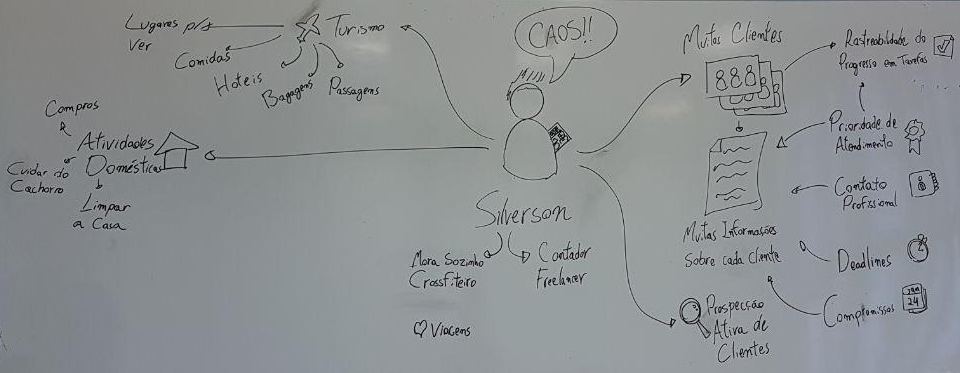
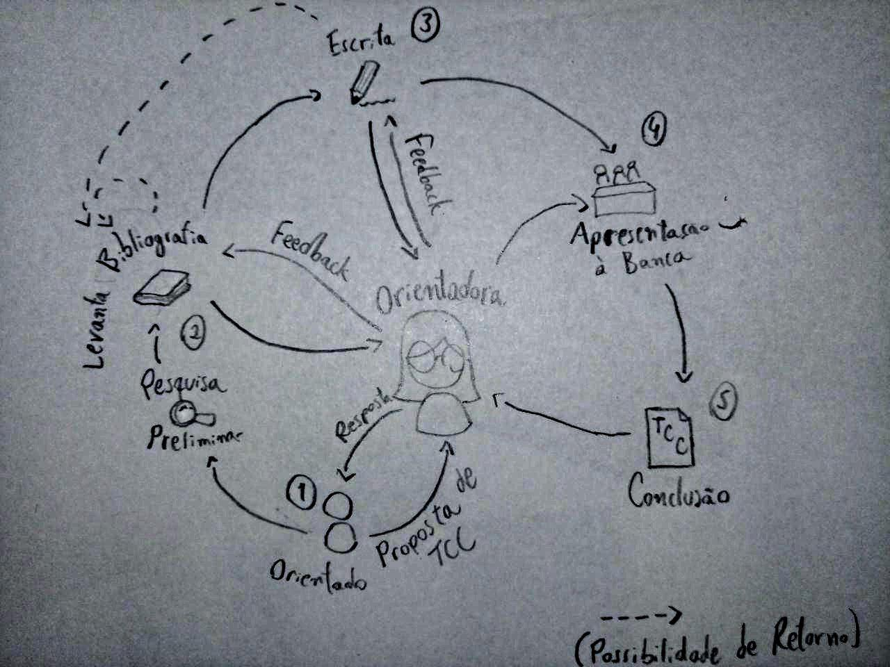
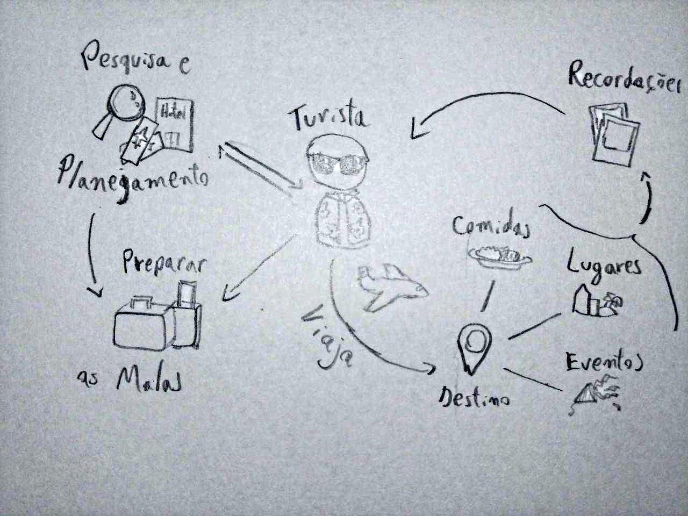
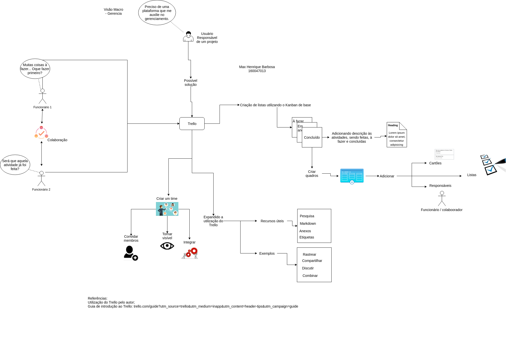
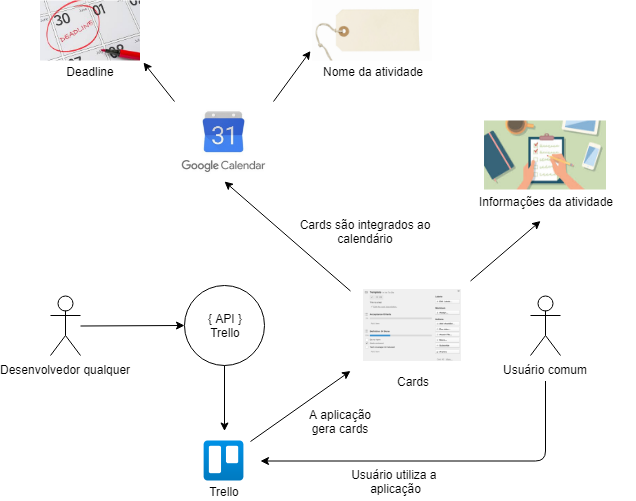
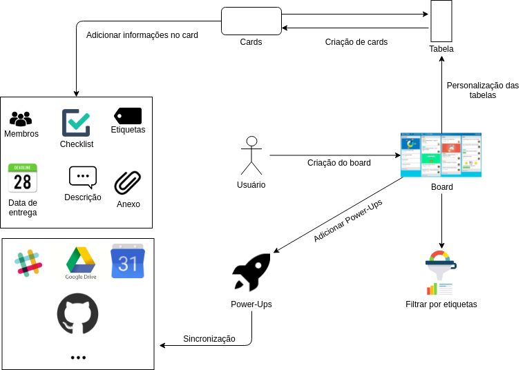

# Rich Pictures

Um Rich Picture é um artefato construído preferencialmente em colaboração com stakeholders a fim de ilustrar e, assim, trazer uma melhor compreensão do problema a ser resolvido pela equipe de desenvolvimento.

Não há formalidades sobre a confecção de um Rich Picture, mas é boa prática que ele tenha o escopo definido por um foco e um fluxo compreensível pelos envolvidos nos projetos, desenvolvedores ou não.

## Primeiros esboços

### Primeira Versão

Esta é a primeira versão de Rich Picture confeccionada pela equipe a fim de averiguar o problema que o Trello se propõe a resolver.

O time percebeu os pontos de confusão e a falta de foco do desenho.

### Visão Geral

Na próxima tentativa, a equipe definiu melhor a problemática. Note que a imagem tem um foco nítido, mas ainda não tão bem descrito, ilustrado pelos balões de conversação ao centro.

Obs: Houve preferência pela confecção manual do Rich Picture, sem a necessidade de ferramentas digitais a priori para uma melhor praticidade e agilidade na execução da ideia. Isso possibilitou uma melhor eficiência da equipe e maior engajamento e fluidez durante reuniões.

### Criação de Boards

Aqui pretende-se entender o funcionamento da criação de boards. Percebemos o fluxo, desde elementos do mundo real surgir com a demanda de organização até o uso dos cards. No caminho, foram denotadas as funcionalidades em análise.

### Interoperabilidade

Neste Rich Picture, tentamos entender a necessidade e o uso da interoperabilidade. Novamente, partimos das necessidades do mundo real e traçamos o caminho para o uso dessa funcionalidade especifica.

## Exemplos de Personas

Para ilustrar como uma ferramenta de organização pode ter demandas bem variadas, foram criadas personas, cada uma com suas necessidades peculiares.

#### Silverson

#### Orientadora

#### Turista

Com isso, é perceptível a variedade de problemas que uma aplicação de organização, como o Trello, deve resolver. Esses rich pictures podem também ser usados para traçar um ponto em comum entre a vasta diferença dos problemas. Aqui fica claro como ter uma aplicação simples e maleável pode atrair usuários.

### Visão Macro da Aplicação

Foi feito também um rich picture sem muitas especificações, com seu foco principal na visão "ampla" do que acontece (e caminhos seguidos), nas relações entre os usuários e a aplicação.

Dessa forma têm-se uma noção da realação entre os usuários juntamente com as possibilidades de funcionalidades dentro da aplicação e ao longo dos projetos. Tais funcionalidades que serão úteis em contextos específicos e outras que auxiliam até necessidades mais básicas.

### Integração com o Google Calendar

Nesse rich picture é possivel observar algumas das funcionalidades em que a integração do trello com o Google Calendar traz a aplicação. Essa integração é feita a partir da API aberta do Trello, onde programadores podem usa-la para criar esse tipos de integração, desde que siga o regulamento do Trello.

### Contato Inicial

