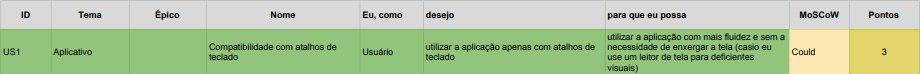

## Backlog do Produto Aplicativo

### US1 - Tornar atalhos de teclado compatíveis

- [ ] - A funcionalidade deve possibilitar navegar o site usando apenas atalhos do teclado.
- [ ] - A funcionalidade deve possibilitar selecionar itens da tela usando o teclado.
- [ ] - A funcionalidade deve exibir uma caixa em volta do item selecionado pelo atalho de teclado.
- [ ] - A funcionalidade deve possibilitar 'clicar' em itens pelo uso da tecla enter.
- [ ] - A funcionalidade deve possibilitar clicar dentre caixas por meio da tecla tab.