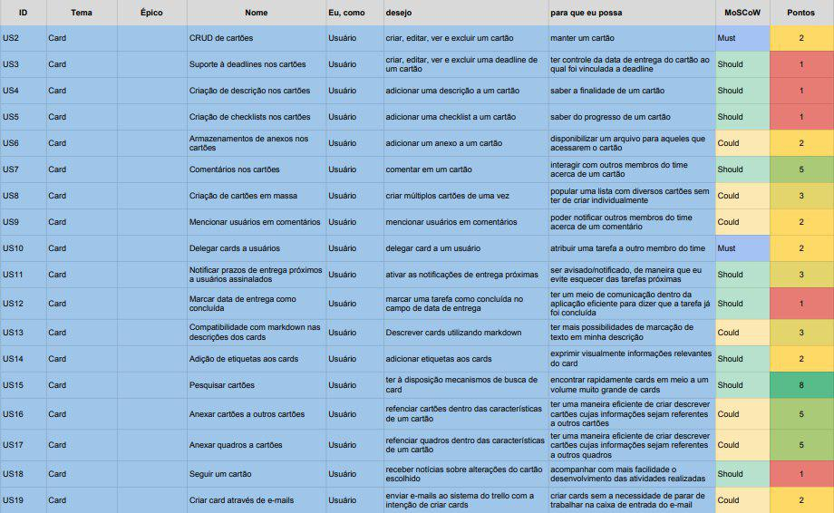

## Backlog do Produto Card

### US2 - CRUD do card

- [ ] - Possibilitar criação do Card
- [ ] - Possibilitar a edição do Título do Card
- [ ] - Possibilitar a expansão do Card para editar as informações
- [ ] - Possibilitar o arquivamento do Card

### US3 - Criar deadlines nos cards

- [ ] - Criar botão para criar uma Deadline
- [ ] - Criar botão para editar uma Deadline
- [ ] - Criar botão para deletar uma Deadline
- [ ] - Possibilitar a escolha da deadline digitando a data
- [ ] - Possibilitar a escolha da deadline no calendário

### US4 - Criar descrição nos cards

- [ ] - Possibilitar a criação de uma descrição para o Card
- [ ] - Criar botão para editar a descrição do Card
- [ ] - Possibilitar Formatação Especial na descrição do Card
- [ ] - Exibir Ajuda para Formatação

### US5 - Criar checklists nos cards

- [ ] - Criar botão para criar Checklist
- [ ] - Criar botão para editar título Checklist
- [ ] - Criar botão para deletar Checklist
- [ ] - Possibilitar copiar itens de outra checklist
- [ ] - Criar botão para adicionar Item em Checklist
- [ ] - Criar atalho para marcar membros no item de checklist
- [ ] - Criar atalho pra emoji no item de checklist
- [ ] - Criar botão para excluir Item de Checklist
- [ ] - Possibilitar a converção de um Item em card

### US6 - Armazenar anexos nos cards

- [ ] - Adicionar opção de anexar arquivo a partir do Computador
- [ ] - Adicionar opção de anexar arquivo a partir do Trello
- [ ] - Adicionar opção de anexar arquivo a partir do Google Drive
- [ ] - Adicionar opção de anexar arquivo a partir do Dropbox
- [ ] - Adicionar opção de anexar arquivo a partir do Box
- [ ] - Adicionar opção de anexar arquivo a partir do OneDrive
- [ ] - Adicionar opção de anexar arquivo a partir de link
- [ ] - Possibilitar a adição de um anexo a um comentário 
- [ ] - Criar opção de remoção de um Anexo

### US7 - Comentar nos cards

- [ ] - Possibilitar adicionar Comentário
- [ ] - Criar atalho para adicionar anexo no comentário
- [ ] - Criar atalho para Adicionar Emoji ao comentário
- [ ] - Criar atalho para mencionar card no comentário
- [ ] - Criar atalho para mencionar Membros no comentário
- [ ] - Criar botão para editar comentário
- [ ] - Possibilitar excluir comentário
- [ ] - Possibilitar reagir com emoji ao comentário

### US8 - Criar cards em massa

 - [ ] - Criar opção de criação de vários cards quando inserido uma lista de temas na criação de cards
 - [ ] - Criar cards correspondentes aos temas inseridos
 - [ ] - Vincular cards a lista na qual foi criado

### US9 - Mencionar usuários em comentários

 - [ ] - Criar opção de mencionar membros na caixa de comentário
 - [ ] - Mostrar lista de membros do Board quando opção de mencionar for selecionada
 - [ ] - Gerar, na caixa de comentário, referencia à membro(s) selecionado(s)

### US10 - Delegar cards a usuários

 - [ ] - Criar opção de 'membros' no menu lateral da página card
 - [ ] - Mostrar lista de membros do Board quando opção 'membros' for selecionada
 - [ ] - Associar membro à card
 - [ ] - Mostrar lista de membros aos quais o card foi delegado no topo da página do card

### US11 - Notificar prazos de entrega próximos a usuários assinalados

 - [ ] - Criar notificação na aba de notificações da aplicação com informações do card que possui prazo de entrega próximo
 - [ ] - Enviar email com nome do card, link e data de entrega

### US12 - Marcar data de entrega como concluída

 - [ ] - Criar checklist junto à indicação da data de entrega presente no card
 - [ ] - Mudar cor da área onde se encontra a data de entrega para indicar a mudança de status da mesma

### US13 - Gerar descrições dos cards com markdown

- [ ] - Adicionar compilador de markdown à caixa de texto de descrição dos cards

### US14 - Adicionar etiquetas aos cards

- [ ] - Criar opção 'etiquetas' no menu lateral da página card
- [ ] - Mostrar lista de membros do Board quando opção 'etiquetas' for selecionada
- [ ] - Associar etiqueta(s) à card
- [ ] - Mostrar lista de etiquetas na página do card

### US15 - Pesquisar cards

- [ ] - Desenvolver barra de busca
- [ ] - A busca deve mostrar todos os cards com o nome relacionado
- [ ] - Deverá haver acesso ao card pela pesquisa

### US16 - Anexar cards a outros cards 

- [ ] - Botão para anexar card, boards, links, arquivos e power-ups em um card
- [ ] - Deve exibir uma barra de busca / um espaço para colar o link que deseja ser anexado
- [ ] - Escrever o nome do card faz com que ele apareça, facilitando a questão de anexar
- [ ] - Após o anexo deve ser exibido no card o que foi anexado (card), e quem anexou

### US17 - Anexar boards a cards 

- [ ] - Botão para anexar card, boards, links, arquivos e power-ups em um card
- [ ] - Deve exibir uma barra de busca / um espaço para colar o link que deseja ser anexado
- [ ] - Escrever o nome do card faz com que ele apareça, facilitando a questão de anexar
- [ ] - Após o anexo deve ser exibido no card o que foi anexado (board), e quem anexou

### US18 - Seguir um card

- [ ] - Criar um botão dentro de card 
- [ ] - Deve ser discreto 
- [ ] - Deve fornecer feedback visual sobre estar seguindo
- [ ] - Permite ao usuário receber notificações sobre o card que está sendo seguido

### US19 - Criar card através de e-mails

- [ ] - Fornecer um link para o usuário
- [ ] - Link vincula o board como um email para o board
- [ ] - O card pode ser criado através desse link
- [ ] - O link funciona como um email do board
