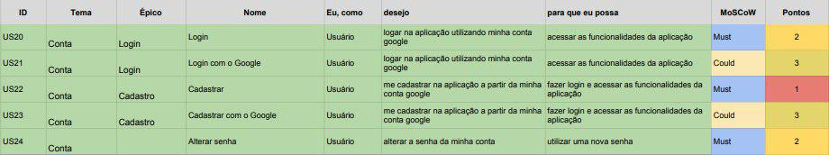

## Backlog do Produto Conta

### US20 - Logar

- [ ] Mostrar na tela inicial o botão do login com email e senha
- [ ] Move o usuário para dentro da aplicação após a inserção do email e da senha

### US21 - Logar com o Google

- [ ] Mostrar o botão com nome e logo do Google na tela inicial da aplicação
- [ ] Botão disponibiliza possíveis contas para login
- [ ] Ao clicar, e se usuário tiver conta, ele tem acesso a aplicação

### US22 - Cadastrar usuário

 - [ ] A funcionalidade deve solicitar nome, email e senha da nova conta do usuário.
 - [ ] A funcionalidade deve exibir possiveis erros referente a email inválidos ou email já usado pelo sistema.
 - [ ] A funcionalidade deve cadastrar o usuário no sistema.
 - [ ] A funcionalidade deve logar o usuário no sistema.
 - [ ] A funcionalidade deve mostrar a página inicial do sistema.

### US23 - Cadastrar usuário com o Google

 - [ ] A funcionalidade deve solicitar o email e senha da conta Google do usuário.
 - [ ] A funcionalidade deve exibir possiveis erros referente a email e senha inválidos ou email já usado pelo sistema.
 - [ ] A funcionalidade deve cadastrar o usuário no sistema.
 - [ ] A funcionalidade deve logar o usuário no sistema.
 - [ ] A funcionalidade deve mostrar a página inicial do sistema.

### US24 - Alterar Senha

 - [ ] A funcionalidade deve solicitar o antingo login e senha do usuário.
 - [ ] A funcionalidade deve exibir possiveis erros referente ao antigo login do usuário.
 - [ ] A funcionalidade deve exibir se foi concluída a tarefa para feedback do usuário.
 - [ ] A funcionalidade deve conseguir alterar a senha guardada antes pelo usuário.
