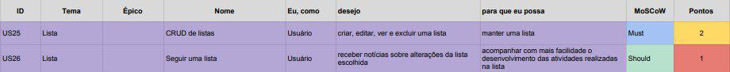

## Backlog do Produto Lista

### US25 - CRUD de Listas

 - [ ] - A funcionalidade deve aparecer visualmente de forma intuitiva no board do usuário.

 - [ ] -  A funcionalidade deve pedir que o usuário dê um nome a nova lista.

 - [ ] -  A funcionalidade deve exibir a nova lista criada após a escolha do nome.

 - [ ] -  A funcionalidade deve exibir após criada, um botão para ampliar as possibilidades de edição.

 - [ ] -  A funcionalidade deve ser visualizada no board após sua criação.

 - [ ] -  A funcionalidade deve mostrar dentro de mais opções a possibilidade de excluir e arquivar a lista.

### US26 - Seguir uma Lista

 - [ ] - A funcionalidade deve aparecer como uma opção a mais para edição da lista para o usuário.

 - [ ] -  A funcionalidade deve mostrar de forma visual ao usuário que o mesmo está seguindo aquela lista.

 - [ ] -  A funcionalidade deve exibir a nova lista criada após a escolha do nome.

 - [ ] -  A funcionalidade deve notificar ao usuário toda e qualquer alteração realizada naquela lista.
