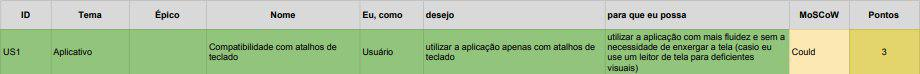

## Backlog do Produto Privacidade

<!--  -->

### US47 - Elaborar da Política de Privacidade

Explicar
- [ ] Quais informações são coletadas do usuário
- [ ] O acontece com as informações coletadas
- [ ] Quem tem acesso às informações coletadas
- [ ] Como são armazenadas as informações coletadas
- [ ] Como acessar e controlar as informações coletadas
- [ ] Como as informações coletadas são transferidas internacionalmente
- [ ] Outras informações importantes acerca de privacidade