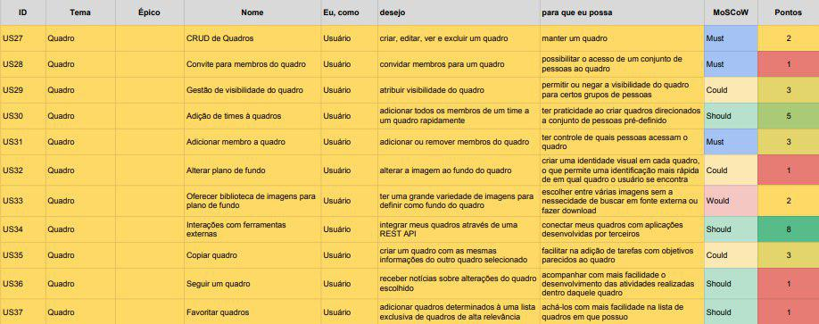

## Backlog do Produto Quadro

### US27 - CRUD de Quadros

- [ ] -  A funcionalidade deve aparecer após ser efetuado o login do usuário.

- [ ] - A funcionalidade deve exibir links e botões para criar novos quadros na aplicação.

- [ ] -  A funcionalidade deve pedir que o usuário dê um nome ao quadro.

- [ ] -  A funcionalidade deve pedir que o usuário atribua um tema ao quadro.

- [ ] -  A funcionalidade deve pedir que o usuário vincule um time ao quadro de forma opcional ou que o usuário informe se é ou não particular.

- [ ] -  A funcionalidade deve exibir o novo quadro criado após as escolhas de definição do quadro.

- [ ] -  A funcionalidade deve exibir após criada, um botão dentro do quadro ampliar as possibilidades de edição.

- [ ] -  A funcionalidade deve dar a opção de fechamento do quadro dentro das opções de maior edição do quadro.

### US28 - Convite para membros do quadro

- [ ] -  A funcionalidade deve aparecer durante e após a criação do quadro.

- [ ] -  A funcionalidade deve permitir que usuários sejam convidados a partir de email, notificação e conta no trello.

- [ ] -  A funcionalidade deve conceder aos convidados a possibilidade de edição dos quadros.

### US29 - Gestão de visibilidade do quadro

- [ ] - A funcionalidade deve aparecer durante e após a criação de um quadro.

- [ ] - A funcionalidade deve permitir a escolha das permissões de visibilidade do quadro.

- [ ] - A funcionalidade deve permitir a alteração das permissões de visibilidade do quadro.

### US30 - Adição de times à quadros

- [ ] -  A funcionalidade deve aparecer durante e após a criação de um quadro.

- [ ] -  A funcionalidade deve permitir a escolha do time a serem adicionados ao quadro.

- [ ] -  A funcionalidade deve permitir a remoção dos times atribuídos ao quadro.

### US31 - Adicionar membro ao quadro

- [ ] -  A funcionalidade deve aparecer após a criação de um quadro.

- [ ] -  A funcionalidade deve permitir a escolha dos membros a serem adicionados ao quadro.

- [ ] -  A funcionalidade deve permitir a remoção dos membros atribuídos ao quadro.

### US32 - Alterar plano de fundo

- [ ] -  A funcionalidade deve aparecer durante e após a criação de um quadro.

- [ ] -  A funcionalidade deve permitir a escolha do plano de fundo a ser exibido.

- [ ] -  A funcionalidade deve permitir a alteração do plano de fundo escolhido.

### US33 - Oferecer biblioteca de imagens para plano de fundo

- [ ] -  A funcionalidade deve aparecer durante e após a criação de um quadro.

- [ ] -  A funcionalidade deve permitir a escolha do plano de fundo através de uma biblioteca com alta variedade de imagens.

- [ ] -  A funcionalidade deve existir sem a necessidade de se fazer download das imagens.

- [ ] -  A funcionalidade deve permitir a alteração da imagem escolhida para o plano de fundo.

### US34 – Integrar um quadro com ferramentas externas

- [ ] -  A funcionalidade deve aparecer após ser acessado o Menu dentro do quadro.

- [ ] - A funcionalidade deve exibir o botão “Power-ups”.

- [ ] -  A funcionalidade deve exibir os temas dos power-ups.

- [ ] -  A funcionalidade deve exibir os power-ups ativados no quadro.

- [ ] -  A funcionalidade deve exibir os power-ups referentes ao tema escolhido.

- [ ] -  A funcionalidade deve exibir um campo de pesquisa por power-ups.

- [ ] -  A funcionalidade deve exibir os power-ups referentes ao que for digitado no campo de pesquisa ou mostrar uma mensagem avisando o usuário de que a pesquisa não teve sucesso.

- [ ] -  A funcionalidade deve exibir o botão “Adicionar” em cada power-up para que ele possa ser adicionado ao quadro.

- [ ] -  Após o botão “Adicionar” ser selecionado, a funcionalidade deve:
- Exibir o botão “Adicionar” para confirmar a adição do power-up ao quadro.
- Exibir o botão “Cancelar” para cancelar a adição do power-up ao quadro.
- Exibir o botão “política de privacidade” para ter acesso as políticas de privacidade do power-up.

### US35 – Copiar um quadro

- [ ] -  A funcionalidade deve aparecer após ser acessado o Menu dentro do quadro.

- [ ] - A funcionalidade deve exibir o botão "Copiar quadro".

- [ ] -  A funcionalidade deve pedir ao usuário o título da cópia do quadro.

- [ ] -  A funcionalidade deve mostrar a privacidade da cópia do quadro.

- [ ] -  A funcionalidade deve dar a possibilidade de modificar a privacidade da cópia quadro a partir da opção “alterar”.

- [ ] -  A funcionalidade deve dar a possibilidade de copiar os cards presentes no quadro através da opção “Manter Cartões”.

- [ ] -  A funcionalidade deve exibir o botão “Criar” para concluir a cópia do quadro.

### US36 – Seguir um quadro

- [ ] -  A funcionalidade deve aparecer após ser acessado o Menu dentro do quadro.

- [ ] - A funcionalidade deve exibir o botão "Seguir" que marca aquele quadro como um quadro seguido.

- [ ] -  A funcionalidade deve notificar o usuário sobre alterações no quadro seguido.

### US37 – Favoritar quadros

- [ ] -  A funcionalidade deve aparecer após ser efetuado o login do usuário, ao entrar no quadro e ao acessar a opção "quadros".

- [ ] - A funcionalidade deve exibir um botão em formato de estrela para favoritar o quadro.

- [ ] -  A funcionalidade deve dar prioridade na tela inicial aos quadros favoritados.

