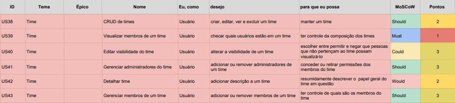

## Backlog do Produto Time

### US38 - CRUD de Times

- [ ] A funcionalidade deve aparecer após ser efetuado o login do usuário e ao tentar criar uma cópia de um board.
- [ ] A funcionalidade deve exibir links e botões para criar novos times na aplicação.
- [ ] A funcionalidade deve pedir que o usuário dê um nome ao time.
- [ ] A funcionalidade deve pedir que o usuário atribua uma descrição ao time se ele quiser.
- [ ] A funcionalidade deve exibir o botão "Criar" após o nome ter sido digitado.
- [ ] A funcionalidade deve exibir o novo time criado.
- [ ] A funcionalidade deve exibir após criada, um botão "Editar Perfil do Time" para que possam ser editadas informações do time.
- [ ] Após ser selecio nado o botão "Editar Perfil do Time", a funcionalidade deve:
- Exibir a o botão "Salvar" para salvar as alterações realizadas.
- Exibir a o botão "Calcelar" para cancelar as alterações realizadas.
- [ ] A funcionalidade deve exibir o botão "Qadros" para mostrar os boards relacionados ao time.
- [ ] A funcionalidade deve exibir o botão "Membros" para mostrar os membros do time ou convidar novos membros.
- [ ] A funcionalidade deve exibir o botão "Configurações" para poder editar configurações do time como:
- Visibilidade do Time.
- Vinculação de Time do Slack.
- Opção de excluir o time.
- confgurações adicionais para membros que assinaram o Business Class.
- [ ] A funcionalidade deve exibir o botão "Business Class" para poder ser feita a assinatura do Business Class.

### US39 Visualizar membros de um time
- [ ] Deve haver um painel de membros na página de membros.
- [ ] O painel deve expor uma lista com todos os membros pertencentes ao time.
- [ ] Devem ser exibidos dos usuários o nome e o nome cadastrado de usuário.
- [ ] Deve ser exibido o número de boards do time em que o membro se encontra.
- [ ] Deve ser exibido qual é o papel do membro no time (Normal ou Administrador).
- [ ] Deve haver a opção de sair do time na linha que representa o usuário visualizando a lista de membros.
- [ ] Nos menu lateral da home page, ao clicar em um time, deve haver uma opção que leve o usuário à páginas de membro.

### US40 Editar visibilidade do time

- [ ] No painel de configurações do time, deve haver uma opção de alteração de visibilidade
- [ ] Deve haver as opções Particular e Público disponíveis.
- [ ] A opção Particular não deve ser, de nenhuma maneira que não o convite ao ingresso, visível para não membros.
- [ ] A opção de Público deve estar indexado pelos sistemas da aplicação, podendo, inclusive, ser encontrado por mecanismos de buscas externos, como o Google ou Bing.
- [ ] Cada opção deve conter um texto, o menor possível que descreva, a nível de usuário, qual o comportamento esperado.

### US41 - Gerenciar administradores do time

- [ ] No painel de membros, deve haver a opção de alterar o papel dos membros para que forem administradores.
- [ ] Em cada opção, deve conter um texto, o menor possível que descreva, a nível de usuário, qual o comportamento esperado.

### US42 - Detalhar time

- [ ] No painel do time, deve haver uma opção de Editar Perfil do Time. Esta opção deve abrir, na mesma página, um formulário de edição.
- [ ] No formulário de edição, deve haver o campo de Nome do grupo.
- [ ] No formulário de edição, deve haver o campo de nome curto do grupo.
- [ ] No formulário de edição, deve haver o campo opcional de website do grupo.
- [ ] No formulário de edição, deve haver o campo de descrição opcional.

### US43 - Gerenciar membros de um time

- [ ] Para a visão de administrador, deve haver uma opção de remover o membro do time, que peça confirmação no clique.
- [ ] Deve haver um campo para inserção de endereço de e-mail para o qual será enviado convite para ingresso no time.
- [ ] Deve haver um mecanismo de busca para encontrar usuário atavés de seus nomes ou nomes de usuário.
- [ ] Deve haver um campo onde se possa digitar vários e-mails ou nomes de usuários, de maneira que todos os nomes ou e-mails recebam o convite.
- [ ] Deve haver a opção de criar um link de convite, através do qual se possa ingressar no time.