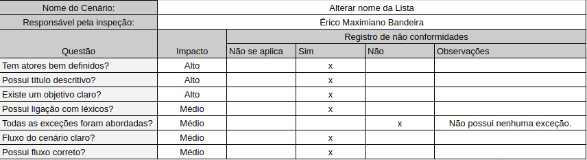
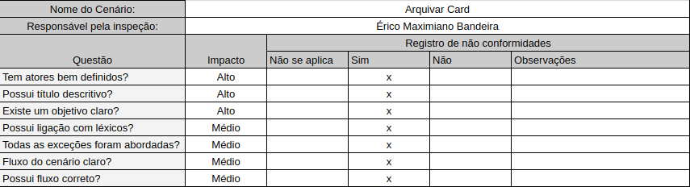
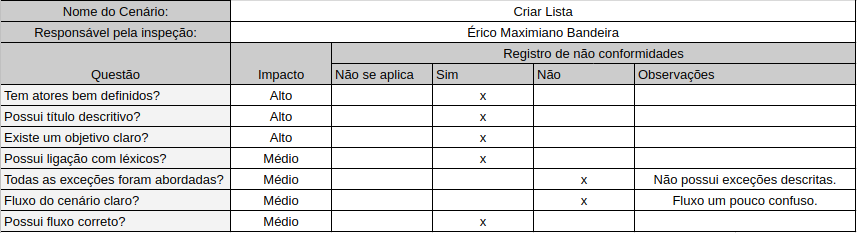
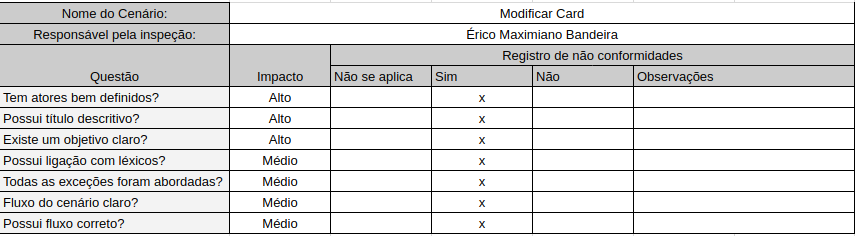

# Cenários

## CN10 Adicionar Sticker

## CN12 Background

## CN14 Copiar Quadro

## CN11 ditar e Remover Sticker

## CN17 Exportar JSON

## CN16 Fechar Quadro

## CN13 Filtrar Cartões

## CN18 Retirar Membro do Time

## CN15 Seguir Quadro

## CN45 Criar Board Time

## Ver Board

## CN48 Adicionar Membros Card

## CN49 Descrição Card

## CN50 Adicionar Checklist

## CN51 Adicionar Etiqueta Card

## CN52 Adicionar Deadline Card

## CN53 Adicionar Comentário Card

## CN54 Permissõess Comentário

## CN01 Login

## CN02 Login Google

## CN03 Cadastro

## CN04 Alterar Senha

## CN05 Alterar Configurações de Notificação

## CN06 Ver Notificações

## CN07 Criar Times

## CN08 Convidar Usuários para Time

## CN09 Imprimir Board

## [Removido] Adicionar Descrição Time

## CN19 Editar Descrição Time

## CN20 Editar Visibilidade Time

## CN21 Vincular Slack

## CN22 Permitir Comentário

## CN23 Negar Acesso a um Board

## CN30 Customizar Label

## CN31 Adicionar Anexo em Card

## CN32 Mover Card

## CN33 Responder Comentário

## CN41 Alterar Nome Lista

## CN29 Arquivar Card 

## CN42 Arquivar Lista

## CN25 Criar Card

## CN40 Criar Lista

## CN26 Modificar Card

